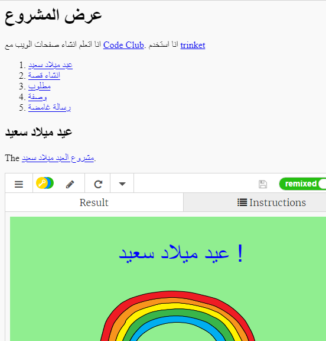

## المقدمة

في هذا المشروع ، ستقوم بإنشاء عرض لمشاريع HTML الخاصة بك والتعرف على الروابط وتضمين المصادر.

### معلومات إضافية لقادة النادي

إذا كنت بحاجة إلى طباعة هذا المشروع، فيُرجى استخدام [النسخة القابلة للطباعة](https://projects.raspberrypi.org/en/projects/project-showcase/print).

## \--- collapse \---

## title: ملاحظات قادة النادي

## مقدمة:

في هذا المشروع ، يتم تعريف الأطفال على hyperlinks وتضمين trinket ومشاريع scratch داخل صفحة ويب.

## الموارد المتوفرة على الإنترنت

نوصي باستخدام [trinket](https://trinket.io/) لكتابة ملفات HTML و & CSS على الإنترنت. يحتوي هذا المشروع على ملف trinket التالي:

* ["معرض المشروع" نقطة البداية -- jumpto.cc/web-showcase](http://jumpto.cc/web-showcase)

يمكن أن يستخدم الأطفال أيضًا ملف trinket الفارغ هذا [(jumpto.cc/html-blank)](http://jumpto.cc/html-blank) لكتابة ملفات HTML و & CSS، أو يمكنهم استخدام قالب trinket هذا [(jumpto.cc/html-template)](http://jumpto.cc/html-template).

كما يوجد مشروع trinket يحتوي على نموذج حل للتحديات:

* ['Project Showcase Finished' -- trinket.io/html/5b815ab120](https://trinket.io/html/5b815ab120)

## الموارد المتوفرة دون اتصال بالإنترنت

هذا المشروع يمكن [إكماله دون اتصال بالإنترنت](https://www.codeclubprojects.org/en-GB/resources/webdev-working-offline/) إذا كنت تفضل ذلك. يمكنك الوصول إلى موارد المشروع من خلال النقر فوق رابط "مواد المشروع" الخاص بهذا المشروع. يحتوي هذا الرابط على قسم "موارد المشروع"، الذي يتضمن الموارد التي يحتاج إليها الأطفال لإكمال هذا المشروع من دون اتصال بالإنترنت. تأكد من أن كل طفل لديه حق الوصول إلى نسخة من هذه الموارد. يتضمن هذا القسم الملفات التالية:

* project-showcase/index.html
* project-showcase/style.css
* template/template.html
* template/style.css

يمكنك أيضًا العثور على نسخة كاملة من تحديات هذا المشروع في قسم "موارد المتطوعين" الذي يحتوي على:

* project-showcse-finished/index.html
* project-showcse-finished/style.css

(جميع الموارد المذكورة أعلاه قابلة للتنزيل أيضًا كملفات `.zip` للمشاريع والمتطوعين)

Note that if the children have completed their other projects offline then they won't be able to embed them but they will still be able to link to them.

## أهداف التعلم

* This project introduces text links to other webpages and to named ids within a page. It also introduces embedding trinkets and Scratch projects into a webpage. 

يتناول هذا المشروع عناصر من معايير المناهج الرقمية الخاصة بـ [Raspberry Pi](http://rpf.io/curriculum):

* [الأصول الأساسية للتصميمات ثنائية الأبعاد وثلاثية الأبعاد](https://www.raspberrypi.org/curriculum/design/creator).

## التحديات

* “Add another link” - Add links to more webpages;
* “Create a List of Your Projects” - Create links to previous web projects;
* “Embed More Projects” - Use CSS to create new styles.

\--- /collapse \---

## \--- collapse \---

## مواد المشروع

## موارد المشروع

* [ملف.zip يحتوي على جميع موارد المشروع](resources/showcase-project-resources.zip)
* [Online Trinket containing all 'Project Showcase' project resources](http://jumpto.cc/web-showcase)
* [قالب Trinket عبر الإنترنت](http://jumpto.cc/trinket-template)
* [Trinket فارغ عبر الإنترنت](http://jumpto.cc/trinket-blank)
* [template/index.html](resources/template-index.html)
* [template/style.css](resources/template-style.css)
* [project-showcase/index.html](resources/project-showcase-index.html)
* [project-showcase/style.css](resources/project-showcase-style.css)

## موارد قادة النادي

* [ملف.zip يحتوي على جميع موارد المشروع المكتملة](resources/showcase-volunteer-resources.zip)
* [مشروع Trinket المكتمل على الإنترنت](https://trinket.io/html/1d4d4c5ce1)
* [project-showcase-finished/index.html](resources/project-showcase-finished-index.html)
* [project-showcase-finished/style.css](resources/project-showcase-finished-style.css)

\--- /collapse \---