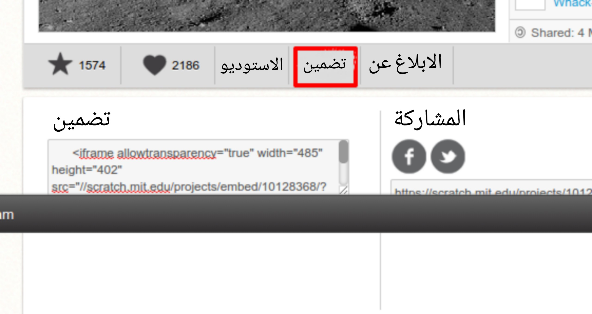
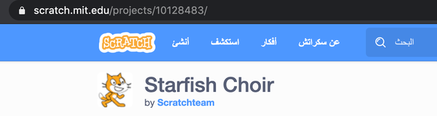

\--- challenge \---

## التحدي: إنشاء عرض جديد

Trinkets ليست الشيء الوحيد الذي يمكنك تضمينه في صفحة ويب. يمكنك تضمين أشرطة الفيديو، widgets (مثل widget الطقس) أو مشاريع scratch.

افتح مثال scratch المتضمن trinket وقم بتشغيله:  https://trinket.io/html/9f7212b8f </ 0>
 

انتقل إلى موقع scratch واعثر على مشروع يعجبك. يمكن أن يكون واحدا من الخاص بك أو واحدا وجدته.

إذا اتممت تسجيل الدخول يمكنك النقر فوق الزر "تضمين" أسفل المشروع للحصول على رمز التضمين HTML.

إذا لم تقم بتسجيل الدخول ابحث عن رقم مشروع scratch في عنوان الويب.

قم بإجراء نسخة من كود `<iframe>` في مثال scratch المتضمن وتغيير رقم المشروع إلى أحد المشاريع التي تريد تضمينها:

\--- /challenge \---