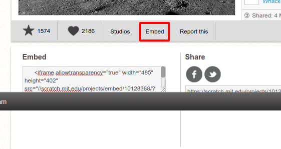

--- challenge ---

## التحدي: أنشئ عرضًا جديدًا

ليست مشاريع trinkets هي الأشياء الوحيدة التي يمكنك تضمينها في صفحة ويب. يمكنك أيضًا إضافة مقاطع فيديو أو عناصر واجهة المستخدم (مثل عنصر واجهة المستخدم المرتبط بأحوال الطقس) أو مشاريع Scratch.

افتح نموذج تضمين مشروع Scratch على trinket وشغِّله: <https://trinket.io/html/9f7212b8fe>

انتقل إلى صفحة الويب لـ Scratch وابحث عن مشروع تفضله. ويمكنك اختيار أحد مشاريعك أو أي مشروع تجده.

إذا قمت بالوصول عن طريق تسجيل الدخول، فيمكنك النقر فوق الزر ‘Embed’ أسفل المشروع للحصول على تعليمات التضمين البرمجية لـ HTML.

إذا لم تصل عن طريق تسجيل الدخول، فابحث عن رقم مشروع Scratch في عنوان الويب الخاص به.

انسخ تعليمات `<iframe>` البرمجية في نموذج تضمين Scratch وغيِّر رقم المشروع إلى رقم المشروع الذي تريد تضمينه:

--- /challenge ---

***
تمت ترجمة هذا المشروع بواسطة متطوعين:

حوراء احمد

علا محمد جزماتي

بفضل المتطوعين ، يمكننا إعطاء الناس في جميع أنحاء العالم فرصة للتعلم بلغتهم الخاصة. يمكنك مساعدتنا في الوصول إلى المزيد من الأشخاص من خلال التطوع للترجمة - مزيد من المعلومات على [rpf.io/translate](https://rpf.io/translate).