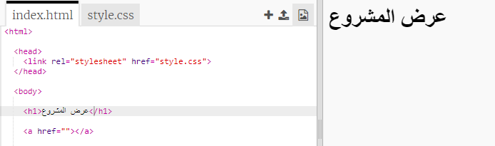
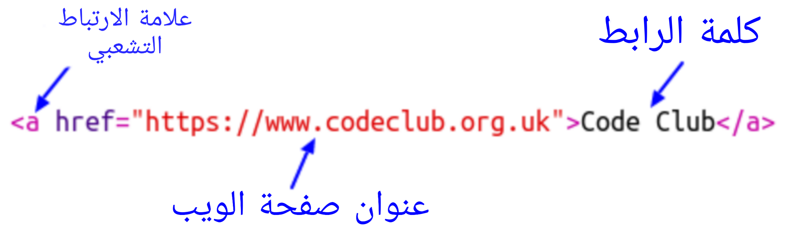
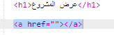
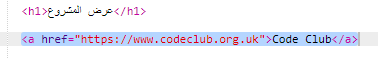
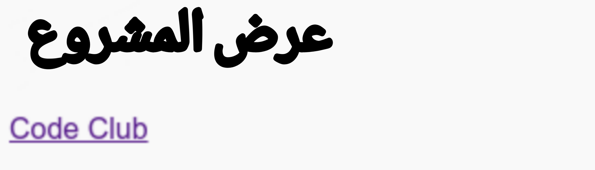
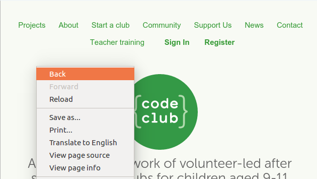
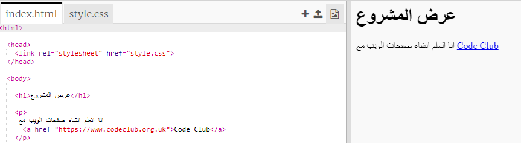

## إضافة روابط إلى صفحات الويب

تتيح لك الارتباطات النصية النقر فوق الكلمات للانتقال إلى صفحة ويب أخرى ؛ وعادة ما يتم تأكيدها.

+ افتح مشروع trinket هذا: [jumpto.cc/web-showcase](http://jumpto.cc/web-showcase).
    
    الآن يجب أن يبدو المشروع الخاص بك مثل هذا:
    
    

+ يستخدم HTML الاشارة `<a>` للروابط.

+ ابحث عن الاشارة `<a>` في مشروعك. 

+ أضف عنوان موقع Code Club على الويب [` https://www.codeclub.org.uk `](https://www.codeclub.org.uk) ونص الرابط:

+ انقر فوق "تشغيل" لاختبار trinket الخاص بك.

+ انقر على رابط Code Club لاختبار صفحة الويب الخاصة بك. سيقوم trinket الخاص بك الآن بعرض صفحة ويب Code Club: 

+ للعودة إلى صفحتك ، يمكنك إما:
    
    + تشغيل trinket الخاص بك مرة أخرى ،
    
    + اضغط على مفتاح Backspace على لوحة المفاتيح ، أو
    
    + انقر بزر الماوس الأيمن واختر الرجوع.

+ Now put your link into a sentence inside a paragraph:

Test your webpage.