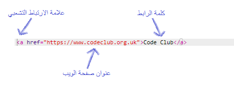
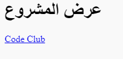

## Adding Links to Webpages

Text links allow you to click on words to go to another web page; they are usually underlined.

+ افتح مشروع trinket هذا: [jumpto.cc/web-showcase](http://jumpto.cc/web-showcase).
    
    الآن يجب أن يبدو الملف الخاص بك مثل هذا:
    
    

+ HTML uses the `<a>` tag for links.

+ Find the `<a>` tag in your project. 

+ Add the Code Club website address [`https://www.codeclub.org.uk`](https://www.codeclub.org.uk) and link text:

+ Click Run to test your trinket.

+ Click on the Code Club link to test your webpage. Your trinket will now show the Code Club webpage: 

+ To get back to your page you can either:
    
    + Run your trinket again,
    
    + Tap the Backspace key on the keyboard, or
    
    + Right-click and choose Back.

+ Now put your link into a sentence inside a paragraph:

Test your webpage.