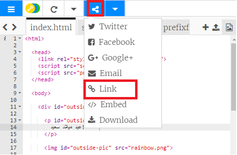
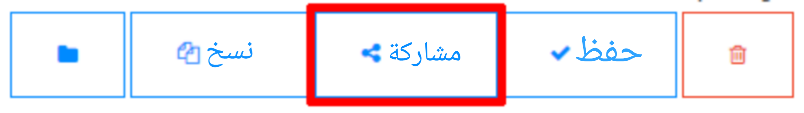
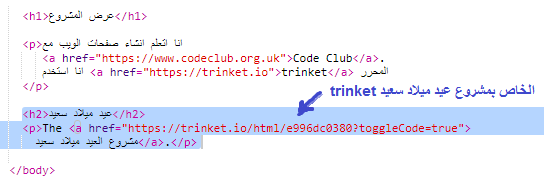
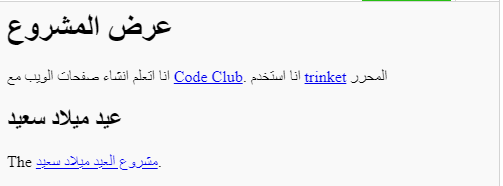

## الرابط الى trinket

يمكنك الارتباط بصفحة الويب لـ trinket.

+ هل حافظت على رابط إلى عيد ميلاد سعيد trinket؟ إذا قمت بذلك ، افتح trinket في علامة تبويب أو نافذة متصفح أخرى. أو افتح trinket الخاص بالمثال المكتمل: [ https://trinket.io/html/e996dc0380 ](https://trinket.io/html/e996dc0380)

+ انقر على قائمة المشاركة أعلى trinket الخاص بك واختر رابط:

إذا فتحت trinket من حسابك ، فابحث عن خيار المشاركة أعلى trinket بدلاً من ذلك:

+ Choose 'Only show code or result (let users toggle between them)' and copy the link to the trinket. 

+ Go back to your Project Showcase trinket and add an `<h2>` heading and a link to your Happy Birthday Project.

Test your webpage; it should look something like this:

Click the Happy Birthday link to test that it takes you to the trinket.