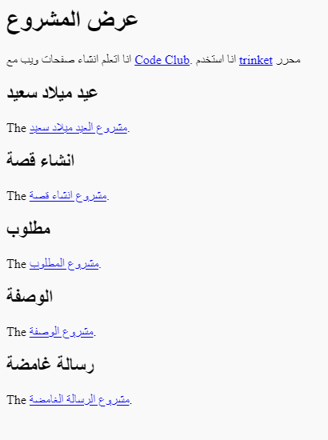

\--- challenge \---

## التحدي: انشاء قائمة مشاريعك

أضف بعضًا من مشاريع HTML & amp؛ CSS التي قمت بإنشائها في Code Club. استخدم عناوين `<h2>` لتنظيم صفحة الويب الخاصة بك.

إذا لم يكن لديك روابط للمشاريع التي أنشأتها ، فيمكنك استخدام أمثلة Code Club:

+ عيد ميلاد سعيد: <https://trinket.io/html/e996dc0380>

+ سرد قصة: <https://trinket.io/html/c8afdef912>

+ مطلوب: <https://trinket.io/html/ebeb56398a>

+ وصفة: <https://trinket.io/html/c0fd9b40cd>

+ رسالة غامضة: <https://trinket.io/html/1d4d4c5ce1>

يجب أن تبدو صفحتك النهائية على النحو التالي:

\--- /challenge \---