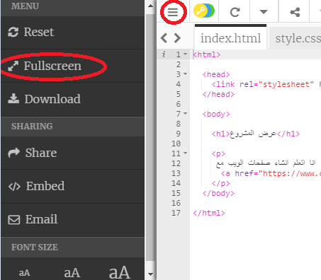
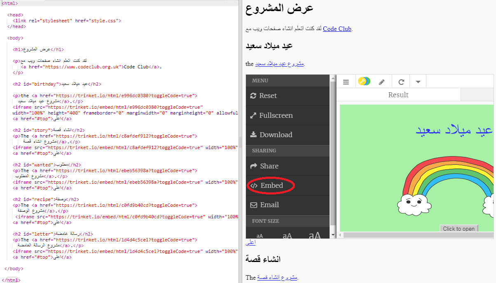
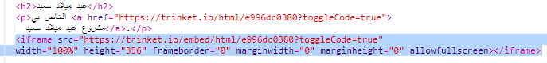
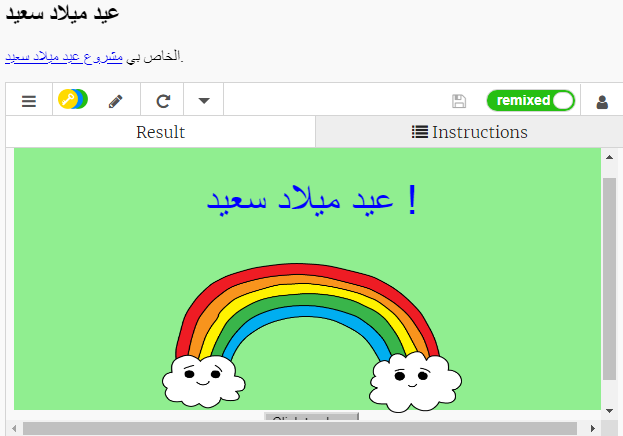
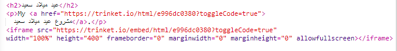

## تضمين المشاريع

إلى جانب إنشاء روابط إلى مشاريع trinket كصفحات ويب، يمكننا أيضًا تضمين هذه المشاريع في صفحة ويب.

+ ربما تريد أن تجرِّب الوضع Fullscreen للعمل في مساحة أكبر:

اضغط على Esc للخروج من وضع ملء الشاشة.

+ شغِّل trinket وانقر فوق الرابط “عيد ميلاد سعيد”.

+ انقر فوق قائمة trinket وحدد ** embed **. وإذا لم تكن تستخدم الوضع Fullscreen، فقد تحتاج إلى التمرير. استخدم شريط التمرير الموجود على اليمين أو مفتاح سهم إلى أسفل في لوحة المفاتيح.

+ اختر "فقط عرض الكود أو النتيجة (اسمح للمستخدمين بالتبديل بينهم)" و ** انسخ ** رمز التضمين ل trinket. 

+ أنشأ Trinket بعض HTML لتضمينها في صفحة الويب الخاصة بك. يستخدم الاشارة `<iframe>` التي تسمح بتضمين المحتوى داخل الصفحة.

+ الآن الصق هذا الكود أسفل رابط trinket العيد ميلاد سعيد:

+ قم بتشغيل trinket الخاص بك لاختباره وسترى مشروع عيد ميلاد سعيد مضمنًا في صفحة الويب. 

+ قد تجد أن الجزء السفلي من trinket الخاص بك لا يتم عرضه. يمكنك إصلاح ذلك عن طريق تغيير قيمة الارتفاع على `<iframe>`. 

تعيين الارتفاع إلى ** 400 </ 0>. إذا قمت بإجراء تغييرات على مشروع عيد ميلاد سعيد قد تحتاج إلى اختيار قيمة مختلفة.
 

