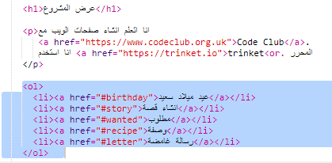
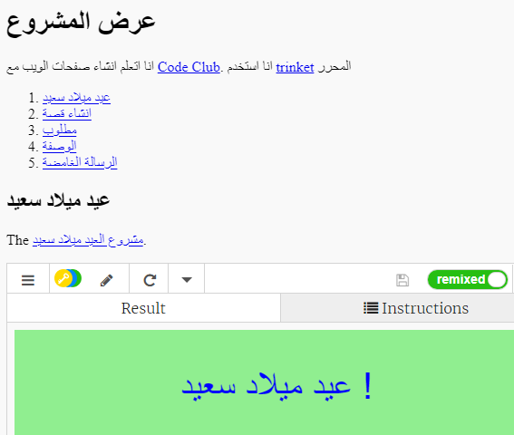

## إنشاء جدول محتويات

دعونا نضيف جدول المحتويات حتى نتمكن من الوصول بسهولة إلى كل مشروع.

+ بالإضافة إلى إمكانية إضافة روابط إلى صفحات الويب الأخرى، يمكننا إضافة رابط إلى جزء من صفحة ويب إذا قمنا بتعيين معرف له. 

أضف معرفًا إلى العنوان الموجود داخل الوسم `<h2>` الخاص بمشروع “عيد ميلاد سعيد”:

+ أضف معرفًا إلى كل مشروع من مشاريعك وأعطه اسمًا قصيرًا: قصة ومطلوب ووَصفة ورسالة.

+ يمكنك ربط عنصر مع معرف عن طريق وضع رمز # '' في مقدمة الاسم. على سبيل المثال،  #Birdayd </ 0>.
</li>
</ul>

إنشاء قائمة أمر من الروابط إلى المشاريع الخاصة بك. (يتم إدخال قوائم أمر في مشروع وصفة.)

<ul>
<li>تشغيل المشروع الخاص بك واختباره بالنقر على الروابط للتحرك إلى المشاريع الخاصة بك. </li>
</ul>

