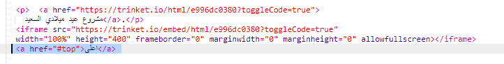
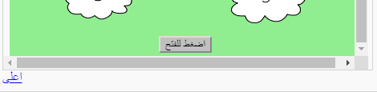

## العودة إلى أعلى الصفحة

+ من المفيد أيضًا أن تكون قادرًا على العودة إلى أعلى الصفحة. وتتضمن لغة HTML الخاصية `top#` لهذا الغرض. 

+ أضف رابطًا إلى الخاصية `top#` بعد كل مشروع مضمَّن في صفحة الويب:

+ اختبر الروابط بالنقر فوق Top للعودة إلى أعلى الصفحة. 

