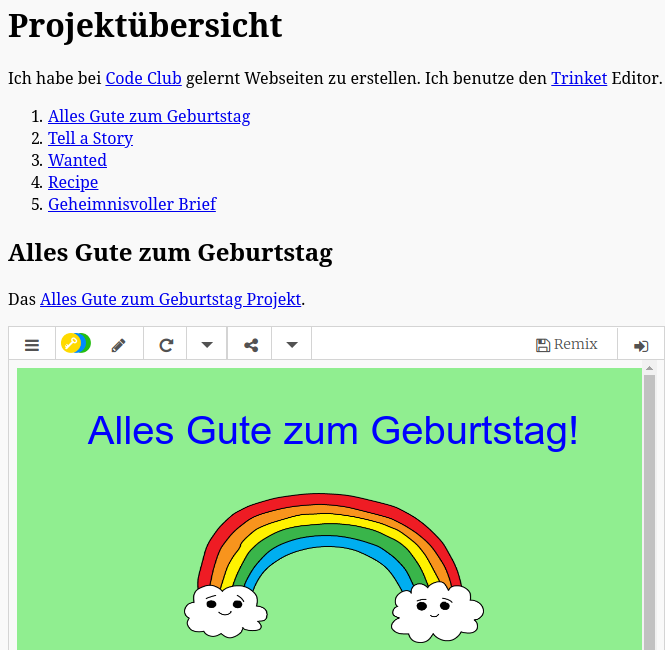

## Einleitung

In diesem Projekt wirst du eine Übersicht deiner HTML-Projekte erstellen und lernen wie man Verlinkungen erstellt und andere Inhalte einbettet.

### Zusätzliche Information für Clubleiter

Falls du dieses Projekt ausdrucken musst, verwende bitte die [druckfreundliche Version](https://projects.raspberrypi.org/en/projects/project-showcase/print).

## \--- collapse \---

## title: Anmerkungen für Clubleiter

## Einleitung:

In diesem Projekt werden Kinder an Hyperlinks und das Einbetten von Trinkets und Scratch-Projekten in einer Webseite herangeführt.

## Online-Ressourcen

Wir empfehlen [Trinket](https://trinket.io/) als Online-Editor für HTML & CSS. Dieses Projekt enthält das folgende Trinket:

* [Startpunkt 'Projekt-Übersicht' -- jumpto.cc/web-showcase](http://jumpto.cc/web-showcase)

Die Kinder können auch dieses leere Trinket [(jumpto.cc/html-blank)](http://jumpto.cc/html-blank) verwenden um ihr eigenes HTML & CSS zu schreiben, oder sie können als Alternative dazu dieses Trinket als Vorlage verwenden [(jumpto.cc/html-template)](http://jumpto.cc/html-template).

Es gibt auch ein Trinket mit einer Beispiellösung für die Herausforderungen:

* ['Fertige Projekt-Übersicht' -- trinket.io/html/5b815ab120](https://trinket.io/html/5b815ab120)

## Offline-Ressourcen

Dieses Projekt kann wahlweise auch [offline](https://www.codeclubprojects.org/en-GB/resources/webdev-working-offline/) durchgeführt werden. Sie können auf die Projektressourcen zugreifen, indem Sie auf den Link "Projektmaterial" für dieses Projekt klicken. Dieser Link enthält einen Abschnitt "Projektressourcen" mit Ressourcen, die die Kinder benötigen, um das Projekt offline abschließen zu können. Stelle sicher, dass jedes Kind Zugriff auf eine Kopie dieser Ressourcen hat. Dieser Abschnitt enthält die folgenden Dateien:

* project-showcase/index.html
* project-showcase/style.css
* template/template.html
* template/style.css

Eine vollständige Version dieses Projekts finden Sie auch im Abschnitt "Ressourcen für Freiwillige". Diese enthält:

* project-showcse-finished/index.html
* project-showcse-finished/style.css

(Alle oben genannten Ressourcen können auch als `.zip`-Dateien für Projekte und für Freiwillige heruntergeladen werden.)

Bedenke, dass Kinder anderen Projekte, die sie offline erstellt haben, nicht einbetten aber dennoch verlinken können.

## Lernziele

* Dieses Projekt führt Textverweise zu anderen Webseiten und zu benannten Elementen der gleichen Seite ein. Es führt ebenfalls an die Einbettung von Trinkets und Scratch Projekten in eine Webseite heran. 

Dieses Projekt deckt die folgenden Kernbereiche des [Raspberry Pi Digital Making Curriculum](http://rpf.io/curriculum) ab:

* [Entwurf von grundlegenden 2D- and 3D-Konstruktionen](https://www.raspberrypi.org/curriculum/design/creator).

## Herausforderungen

* “Add another link” - Add links to more webpages;
* “Create a List of Your Projects” - Create links to previous web projects;
* “Embed More Projects” - Use CSS to create new styles.

\--- /collapse \---

## \--- collapse \---

## title: Projektmaterial

## Projektressourcen

* [.zip-Datei mit allen Projektressourcen](resources/showcase-project-resources.zip)
* [Online Trinket containing all 'Project Showcase' project resources](http://jumpto.cc/web-showcase)
* [Online Trinket-Vorlage](http://jumpto.cc/trinket-template)
* [Leeres online-Trinket](http://jumpto.cc/trinket-blank)
* [template/index.html](resources/template-index.html)
* [template/style.css](resources/template-style.css)
* [project-showcase/index.html](resources/project-showcase-index.html)
* [project-showcase/style.css](resources/project-showcase-style.css)

## Ressourcen für Clubleiter

* [.zip-Datei mit allen fertig gestellten Projektressourcen](resources/showcase-volunteer-resources.zip)
* [Vollständiges Trinket-Projekt (online)](https://trinket.io/html/1d4d4c5ce1)
* [project-showcase-finished/index.html](resources/project-showcase-finished-index.html)
* [project-showcase-finished/style.css](resources/project-showcase-finished-style.css)

\--- /collapse \---