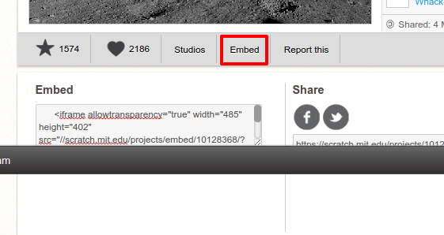
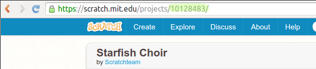

\--- challenge \---

## Aufgabe: Erstelle eine neue Projektübersicht

Trinkets sind nicht das Einzige, das du in eine Webseite einbinden kannst. Du kannst auch Videos, sogenannte "Widgets" (z. B. ein Wetter-Widget) oder Scratch-Projekte einbinden.

Öffne das "Embed Scratch Example" Trinket und starte es: <https://trinket.io/html/9f7212b8fe>

Besuche die Scratch Webseite und finde ein Projekt, das dir gefällt. Das kann sowohl eines deiner eigenen sein oder eines das du gefunden hast.

Wenn du eingeloggt bist, kannst du auf den "Embed" Knopf unterhalb des Projektes klicken, um den HTML-Text zum Einbinden zu erhalten.

Wenn du nicht eingeloggt bist, suche nach der Scratch-Projektnummer in der Internetadresse der Webseite.

Kopiere den `<iframe>` Text auf der "Scratch Embed" Beispielseite und ersetze die Projektnummer mit derjenigen des Projekts, das du einbinden möchtest:

\--- /challenge \---