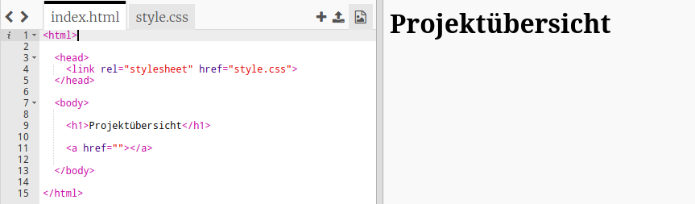
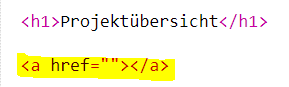
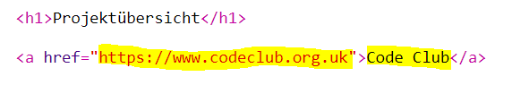
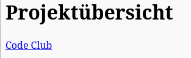
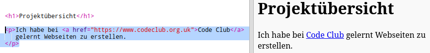

## Links zu Webseiten hinzufügen

Mit Hilfe von Textverweisen kannst du auf bestimmte Worte klicken um zu einer anderen Webseite zu gelangen; sie sind normalerweise unterstrichen.

+ Öffne dieses Trinket: [jumpto.cc/web-showcase](http://jumpto.cc/web-showcase).
    
    Das Projekt sollte so aussehen:
    
    

+ In HTML erstellst du Links mit einem sogenannten "Tag", dem Tag `<a>`.

+ Finde den Tag `<a>` in deinem Projekt. 

+ Füge die Adresse der Code Club Webseite [`https://www.codeclub.org.uk`](https://www.codeclub.org.uk) und den Text der verlinkt werden soll hinzu:

+ Klicke auf "Run" um dein Trinket zu testen.

+ Klicke auf den Code Club Link um deine Webseite zu testen. Dein Trinket sollte nun die Code Club Webseite zeigen: 

+ To get back to your page you can either:
    
    + Run your trinket again,
    
    + Tap the Backspace key on the keyboard, or
    
    + Right-click and choose Back.

+ Now put your link into a sentence inside a paragraph:

Test your webpage.