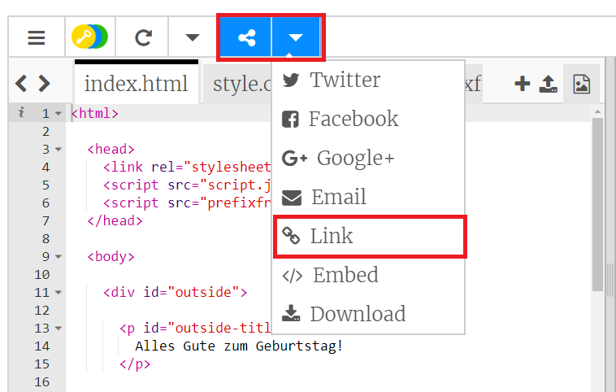
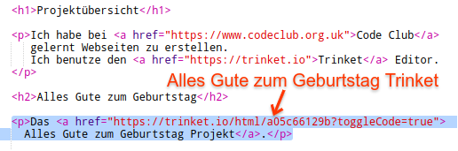
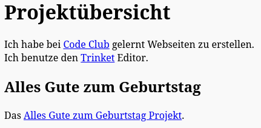

## Link zu einem Trinket

Du kannst die Webseite für ein Trinket verlinken.

+ Hast du noch den Link zu deinem "Happy Birthday" Trinket? Wenn ja, dann öffne dieses Trinket in einem neuen Browser-Tab oder Fenster. Wenn nicht, dann öffne dieses Beispiel-Trinket: <https://trinket.io/html/e996dc0380>

+ Öffne das "Share"-Menü über deinem Trinket und wähle "Link":

Falls du ein Trinket von deinem Benutzerkonto geöffnet hast, dann verwende stattdessen die "Share" Option:

+ Wähle 'Only show code or result (let users toggle between them)' und kopiere den Link zu deinem Trinket. 

+ Gehe zurück zu deinem Projektübersicht Trinket und füge eine `<h2>` Überschrift mit einem Link zu deinem "Happy Birthday" Projekt hinzu.

Teste deine Webseite; sie sollte in etwa so aussehen:

Click the Happy Birthday link to test that it takes you to the trinket.