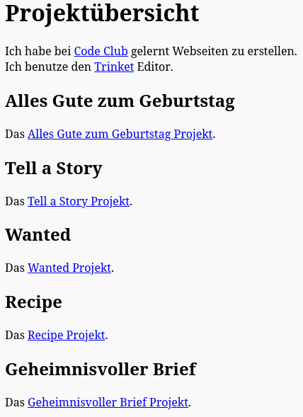

\--- challenge \---

## Aufgabe: Erstelle eine Liste deiner Projekte

Füge einige deiner anderen HTML & CSS Projekte hinzu, die du bei Code Club erstellt hast. Benutze `<h2>`-Überschriften, um deine Webseite zu gliedern.

Falls du keine Links zu Projekten hast, die du selbst erstellt hast, kannst du die folgenden Code Club Beispielprojekte verwenden:

+ Alles Gute zum Geburtstag: <https://trinket.io/html/e996dc0380>

+ Tell a Story: <https://trinket.io/html/c8afdef912>

+ Wanted: <https://trinket.io/html/ebeb56398a>

+ Recipe: <https://trinket.io/html/c0fd9b40cd>

+ Geheimnisvoller Brief: <https://trinket.io/html/1d4d4c5ce1>

Deine fertige Seite sollte in etwa so aussehen:

\--- /challenge \---