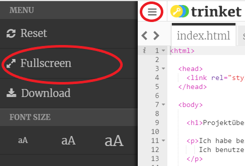
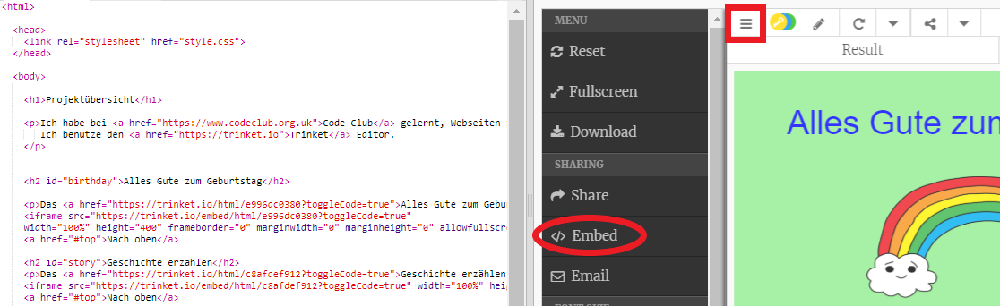
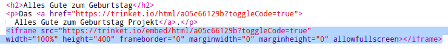
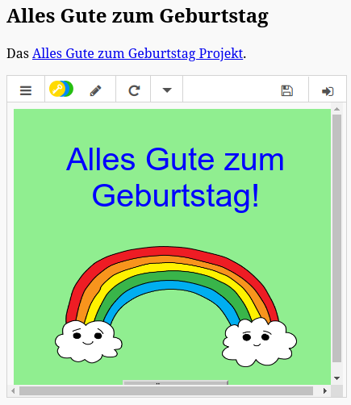
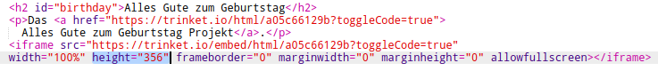
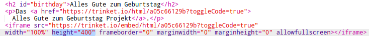

## Einbettung von Projekten

As well as linking to trinkets as webpages we can also embed them in a web page.

+ You might want to try working in Fullscreen mode so you have more space:

Press Esc to exit Fullscreen mode.

+ Run your trinket and click on the Happy Birthday link.

+ Click on the trinket menu and select **embed**. If you're not in Fullscreen mode you may have to scroll. Use the scroll bar on the right or the down arrow on the keyboard.

+ Choose 'Only show code or result (let users toggle between them)' and **copy** the embed code for the trinket. 

+ Trinket has created some HTML for you to include in your webpage. It uses an `<iframe>` tag which allows content to be embedded within a page.

+ Now paste that code under the link to the Happy Birthday trinket:

+ Run your trinket to test it and you should see your Happy Birthday project embedded in the webpage. 

+ You may find that the bottom of your trinket isn't displayed. You can fix that by changing the height value on the `<iframe>`. 

Set the height to **400**. If you made changes to the Happy Birthday project you might need to choose a different value.

