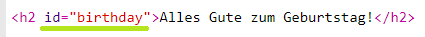
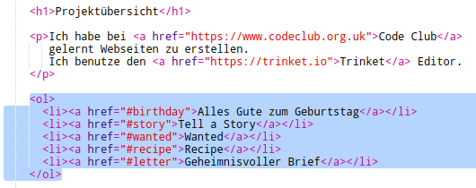
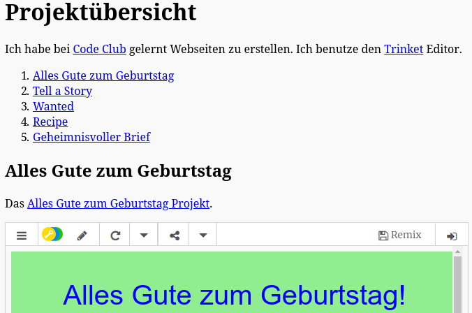

## Erstelle ein Inhaltsverzeichnis

Lass uns ein Inhaltsverzeichnis erstellen, um ganz einfach zu jedem Projekt zu gelangen.

+ Neben Links zu anderen Webseiten können wir auch bestimmte Abschnitten innerhalb einer Webseite verlinken indem wir ihnen eine eindeutige Kennung zuweisen, auch "id" genannt. 

Füge deiner `<h2>`-Überschrift für das "Happy Birthday" Projekt eine id hinzu:

+ Füge jedem deiner Projekte eine id hinzu und gebe ihnen die Kurznamen "story", "wanted", "recipe" und "letter".

+ Du kannst ein Element mit einer id verlinken indem du dem Namen ein Rautezeichen '#' voranstellst. Zum Beispiel `#birthday`.

Erstelle eine nummerierte Liste mit Links zu deinen Projekten. (Nummerierte Listen werden im "Recipe" Projekt eingeführt.)

+ Starte dein Projekt und teste es indem du auf die Links klickst um zu deinen Projekten zu gelangen. 

