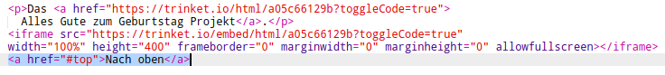

## Zurück nach oben gelangen

+ Es ist zudem nützlich zum Anfang der Seite zurückgelangen zu können. HTML hat `#top` für diesen Zweck.

+ Füge einen Link zu `#top` nach jedem eingebundenen Projekt auf deiner Webseite hinzu:

+ Teste deine Links, indem du auf "Nach Oben" klickst, um zurück zum Anfang der Seite zu gelangen.