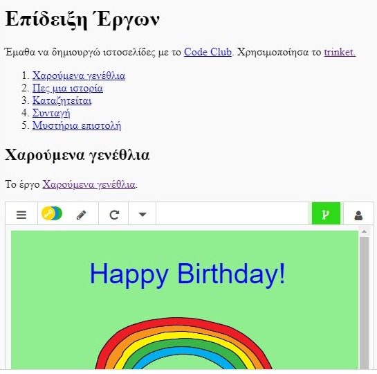

## Εισαγωγή

Σε αυτό το έργο, θα δημιουργήσεις μία παρουσίαση των HTML έργων σου και θα μάθεις για τους συνδέσμους και τρόπους ενσωμάτωσης.

### Πρόσθετες πληροφορίες για τους συντονιστές των ομάδων

Αν χρειαστεί να εκτυπώσεις αυτό το έργο, χρησιμοποίησε την [εκτυπώσιμη έκδοση](https://projects.raspberrypi.org/el-GR/projects/project-showcase/print).

--- collapse ---
---
title: Σημειώσεις συντονιστή ομάδας
---

## Εισαγωγή:

Σε αυτό το έργο, τα παιδιά έρχονται σε επαφή με τους υπερσυνδέσμους και την ενσωμάτωση trinket και έργων Scratch μέσα σε μία ιστοσελίδα.

## Online Πόροι

Συνιστούμε να χρησιμοποιήσεις την εφαρμογή [trinket](https://trinket.io/) για να γράψεις HTML & CSS online. Αυτό το έργο περιλαμβάνει το ακόλουθο trinket:

* ['Επίδειξη έργων' σημείο εκκίνησης -- jumpto.cc/web-showcase](https://trinket.io/html/e8db506886)

Τα παιδιά μπορούν επίσης να χρησιμοποιήσουν αυτό το κενό trinket [(jumpto.cc/html-blank)](http://jumpto.cc/html-blank) για να γράψουν το δικό τους HTML & CSS κώδικα, ή εναλλακτικά αυτό το trinket πρότυπο [(jumpto.cc/html-template)](http://jumpto.cc/html-template).

Υπάρχει επίσης ένα trinket που περιέχει μια υποδειγματική λύση στις προκλήσεις:

* ['Επίδειξη Έργων' Ολοκληρωμένο -- trinket.io/html/5b815ab120](https://trinket.io/html/ffe58a7955)

## Offline Πόροι

Αυτό το έργο μπορεί να [ολοκληρωθεί χωρίς σύνδεση](https://www.codeclubprojects.org/en-GB/resources/webdev-working-offline/) αν προτιμάς. Μπορείς να αποκτήσεις πρόσβαση στους πόρους του έργου κάνοντας κλικ στο σύνδεσμο 'Υλικό έργου'. Αυτός ο σύνδεσμος περιέχει μια ενότητα 'Πόροι έργου', η οποία περιλαμβάνει πόρους που τα παιδιά θα χρειαστούν για να ολοκληρώσουν αυτό το έργο εκτός σύνδεσης. Βεβαιωθείτε ότι κάθε παιδί έχει πρόσβαση σε ένα αντίγραφο αυτών των πόρων. Αυτή η ενότητα περιλαμβάνει τα ακόλουθα αρχεία:

* project-showcase/index.html
* project-showcase/style.css
* template/template.html
* template/style.css

Μπορείτε επίσης να βρείτε μια ολοκληρωμένη έκδοση των προκλήσεων αυτού του έργου στην ενότητα 'Πόροι εθελοντών', η οποία περιέχει:

* project-showcse-finished/index.html
* project-showcse-finished/style.css

(Όλοι οι παραπάνω πόροι μπορούν επίσης να μεταφορτωθούν ως συμπιεσμένα `.zip` αρχεία.)

Σημειώστε ότι αν τα παιδιά έχουν ολοκληρώσει τα έργα τους εκτός σύνδεσης, τότε δε μπορούν να τα ενσωματώσουν αλλά μόνο να παραπέμπουν σε αυτά μέσω συνδέσμων.

## Στόχοι μάθησης

* Το έργο κάνει μια εισαγωγή στους συνδέσμους κειμένου προς άλλες ιστοσελίδες αλλά και σε σημεία (named ids) εντός της ιστοσελίδας. Εισάγει επίσης την ενσωμάτωση trinkets και έργων Scratch σε μία ιστοσελίδα. 

Αυτό το έργο καλύπτει στοιχεία από τις ακόλουθες πτυχές του [Raspberry Pi Digital Curriculum Making](http://rpf.io/curriculum):

* [Σχεδιασμός βασικών στοιχείων 2D και 3D](https://www.raspberrypi.org/curriculum/design/creator).

## Προκλήσεις

* "Πρόσθεσε άλλο ένα σύνδεσμο" - Πρόσθεσε συνδέσμους προς περισσότερες ιστοσελίδες
* "Δημιούργησε μια λίστα των έργων σου" - Δημιούργησε συνδέσμους προς παλαιότερα web έργα σου
* "Ενσωμάτωσε περισσότερα έργα" - Γράψε κώδικα CSS για να δημιουργήσεις νέα στυλ.

--- /collapse ---

--- collapse ---
---
title: Υλικό έργου
---

## Πόροι έργου

* [αρχείο .zip που περιέχει όλους τους πόρους του έργου](resources/showcase-project-resources.zip)
* [Online Trinket που περιέχει όλους τους πόρους του έργου 'Επίδειξη Έργων'](https://trinket.io/html/e8db506886)
* [Online πρότυπο Trinket](http://jumpto.cc/trinket-template)
* [Online κενό Trinket](http://jumpto.cc/trinket-blank)
* [template/index.html](resources/template-index.html)
* [template/style.css](resources/template-style.css)
* [project-showcase/index.html](resources/project-showcase-index.html)
* [project-showcase/style.css](resources/project-showcase-style.css)

## Πόροι συντονιστή ομάδας

* [αρχείο .zip που περιέχει όλους τους πόρους του έργου](resources/showcase-volunteer-resources.zip)
* [Online ολοκληρωμένο έργο στο Τrinket](https://trinket.io/html/ffe58a7955)
* [project-showcase-finished/index.html](resources/project-showcase-finished-index.html)
* [project-showcase-finished/style.css](resources/project-showcase-finished-style.css)

--- /collapse ---