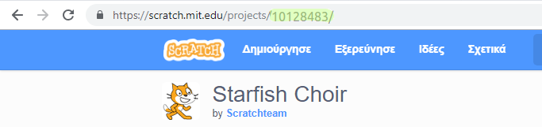

--- challenge ---

## Πρόκληση: Δημιούργησε μια νέα Παρουσίαση

Τα trinkets δεν είναι το μόνο πράγμα που μπορείς να ενσωματώσεις σε μια ιστοσελίδα. Μπορείς να ενσωματώσεις βίντεο, γραφικά widgets (όπως ένα widget καιρού) ή έργα Scratch.

'Ανοιξε το παράδειγμα ενσωματωμένου Scratch trinket και εκτέλεσέ το: <https://trinket.io/html/9f7212b8fe>

Πήγαινε στον ιστότοπο Scratch και βρες ένα έργο που σου αρέσει. Μπορεί να είναι ένα δικό σου ή ένα που βρήκες.

Αν έχεις συνδεθεί στον ιστότοπο Scratch, μπορείς να πατήσεις στο κουμπί 'Embed' κάτω από το έργο για να πάρεις τον HTML κώδικα ενσωμάτωσης.

Αν δεν έχεις συνδεθεί, τότε κοίταξε για τον αριθμό του Scratch έργου στην διαδικτυακή διεύθυνση.

Αντέγραψε τον κώδικα `<iframe>` στο παράδειγμα ενσωματωμένου Scratch και άλλαξε τον αριθμό έργου με αυτόν του έργου που θες να ενσωματώσεις:

--- /challenge ---

**Κοινοτική συνεισφορά μετάφρασης**

Το έργο αυτό μεταφράστηκε από **Διονύσιος Μπραιλας** και αναθεωρήθηκε από **Μάνος Ζεάκης**.

Οι εκπληκτικοί μας εθελοντές-μεταφραστές μας βοηθούν να δώσουμε στα παιδιά όλου του κόσμου την ευκαιρία να μάθουν να προγραμματίζουν. Μπορείτε να μας βοηθήσετε να προσεγγίσουμε περισσότερα παιδιά μεταφράζοντας τα έργα μας - διαβάστε περισσότερα στο [rpf.io/translators](https://rpf.io/translators).