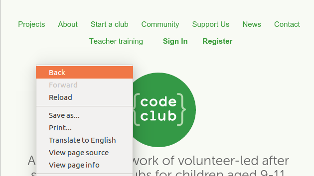

## Πρόσθεση συνδέσμων προς ιστοσελίδες

Οι σύνδεσμοι κειμένου σου επιτρέπουν να κάνεις κλικ σε λέξεις για να μεταβείς σε μια άλλη ιστοσελίδα και είναι συνήθως υπογραμμισμένοι.

+ Άνοιξε αυτό το trinket: [jumpto.cc/web-showcase](https://trinket.io/html/e8db506886).
    
    Το έργο πρέπει να μοιάζει έτσι:
    
    

+ Η γλώσσα HTML χρησιμοποιεί την ετικέτα `<a>` για συνδέσμους.

+ Βρες την ετικέτα `<a>` στο έργο σου. 

+ Πρόσθεσε τη διεύθυνση ιστοτόπου του Code Club [`https://www.codeclub.org.uk`](https://www.codeclub.org.uk) και το κείμενο συνδέσμου:

+ Κάνε κλικ στο κουμπί Run για να δοκιμάσεις το trinket.

+ Κάνε κλικ στο σύνδεσμο Code Club για να δοκιμάσεις την ιστοσελίδα σου. Το trinket θα εμφανίσει την ιστοσελίδα Code Club: 

+ Για να γυρίσεις πίσω στην ιστοσελίδα σου, μπορείς είτε:
    
    + Να εκτελέσεις το trinket ξανά,
    
    + Να πατήσεις το Backspace στο πληκτρολόγιο, ή
    
    + Να κάνεις δεξί κλικ και να επιλέξεις Πίσω.

+ Τώρα βάλε το σύνδεσμο σε μια πρόταση μέσα σε μια παράγραφο:

Δες πως φαίνεται τώρα η ιστοσελίδα σου.