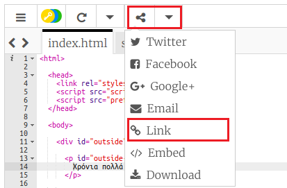
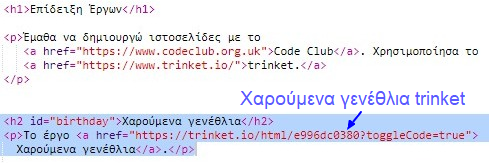
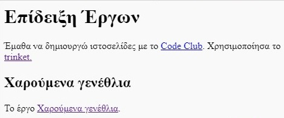

## Σύνδεσμος προς ένα Trinket

Μπορείς να βάλεις σύνδεσμο προς ένα trinket στην ιστοσελίδα σου. 

+ Κράτησες σύνδεσμο για το trinket Ευτυχισμένα Γενέθλια; Αν κράτησες, τότε άνοιξε αυτό το trinket σε άλλη καρτέλα ή παράθυρο του browser. Διαφορετικά, άνοιξε το τελειωμένο παράδειγμα trinket: <https://trinket.io/html/e996dc0380>

+ Πάτησε στο μενού Share πάνω από το trinket σου και επέλεξε Link:

If you opened the trinket from your account then look for the Share option above your trinket instead:

+ Επέλεξε 'Only show code or result (let users toggle between them') και αντέγραψε το σύνδεσμο προς το trinket. 

+ Επέστρεψε στο trinket Παρουσίαση Έργων και πρόσθεσε μια επικεφαλίδα `<h2>` και ένα σύνδεσμο προς το έργο Ευτυχισμένα Γενέθλια.

Δοκίμασε την ιστοσελίδα σου. Θα πρέπει να έχει την εξής μορφή:

Πάτησε το σύνδεσμο Ευτυχισμένα Γενέθλια και έλεγξε ότι σε κατευθύνει στο trinket.