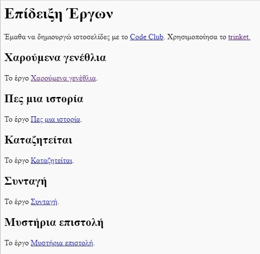

\--- challenge \---

## Πρόκληση: Δημιούργησε μια λίστα των έργων σου

Πρόσθεσε μερικά από τα υπόλοιπα έργα HTML & CSS που έχεις δημιουργήσει στο Code Club. Χρησιμοποίησε επικεφαλίδες `<h2>` για να οργανώσεις την ιστοσελίδα σου.

Αν δεν έχεις συνδέσμους προς τα έργα που δημιούργησες, μπορείς να χρησιμοποιήσεις τα παραδείγματα στο Code Club:

+ Ευτυχισμένα Γενέθλια: <https://trinket.io/html/e996dc0380>

+ Πες μια ιστορία: <https://trinket.io/html/c8afdef912>

+ Καταζητείται: <https://trinket.io/html/ebeb56398a>

+ Συνταγή: <https://trinket.io/html/c0fd9b40cd>

+ Μυστήρια Επιστολή: <https://trinket.io/html/1d4d4c5ce1>

Αμέσως μετά, η ιστοσελίδα σου πρέπει να έχει την εξής μορφή:

\--- /challenge \---