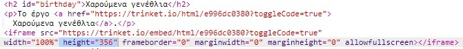

## Ενσωμάτωση έργων

Πέρα από τη δημιουργία συνδέσμων προς trinkets στην ιστοσελίδα, μπορούμε επιπλέον να τα ενσωματώνουμε μέσα στην ιστοσελίδα.

+ Για να έχεις περισσότερο χώρο εργασίας, μπορείς να αλλάξεις σε κατάσταση πλήρους οθόνης:

Πάτησε Esc για να τερματίσεις την κατάσταση πλήρους οθόνης.

+ Εκτέλεσε το trinket σου και πάτησε στο σύνδεσμο Ευτυχισμένα Γενέθλια.

+ Πάτησε στο trinket μενού και επέλεξε **embed**. Αν δεν είσαι σε κατάσταση πλήρους οθόνης, ίσως να χρειαστεί να κυλίσεις την οθόνη (scroll). Χρησιμοποίησε τη μπάρα κύλισης στα δεξιά ή το κάτω βέλος στο πληκτρολόγιο.

+ Επέλεξε 'Only show code or result (let users toggle between them') και **αντέγραψε** τον κώδικα ενσωμάτωσης για το trinket. 

+ To Trinket έχει δημιουργήσει HTML κώδικα για να τον συμπεριλάβεις στην ιστοσελίδα σου. Χρησιμοποιεί μια ετικέτα `<iframe>` που επιτρέπει την ενσωμάτωση περιεχομένου άλλης ιστοσελίδας μέσα στη δική σου.

+ Τώρα επικόλλησε τον κώδικα κάτω από τον σύνδεσμο Ευτυχισμένα Γενέθλια.

+ Εκτέλεσε το trinket σου για να το δοκιμάσεις και θα δεις το έργο Ευτυχισμένα Γενέθλια ενσωματωμένο στην ιστοσελίδα. 

+ Ίσως αντιληφθείς ότι το κάτω μέρος του trinket δεν εμφανίζεται. Μπορείς να το διορθώσεις αλλάζοντας την τιμή ύψους στο `<iframe>`. 

Όρισε το ύψος σε **400**. Αν έχεις κάνεις αλλαγές στο έργο Ευτυχισμένα Γενέθλια, ίσως χρειαστεί να επιλέξεις διαφορετική τιμή.

