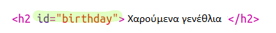
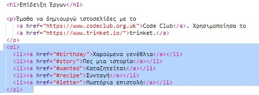
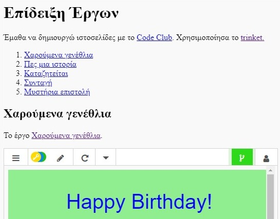

## Δημιούργησε Πίνακα Περιεχομένων

Ας προσθέσουμε έναν Πίνακα Περιεχομένων ώστε να μπορούμε εύκολα να ανοίξουμε ένα έργο.

+ Πέρα από το να δημιουργούμε συνδέσμους προς άλλες ιστοσελίδες, μπορούμε επιπλέον να δημιουργούμε συνδέσμους σε μέρη της ίδιας ιστοσελίδας δίνοντας σε αυτά μια ταυτότητα (id). 

Πρόσθεσε ένα id στην επικεφαλίδα `<h2>` για το έργο Ευτυχισμένα Γενέθλια:

+ Πρόσθεσε ids σε κάθε έργο σου και δώσε σε αυτά σύντομα ονόματα: ιστορία, καταζητείται, συνταγή και επιστολή.

+ Μπορείς να φτιάξεις σύνδεσμο προς ένα στοιχείο με id, βάζοντας το σύμβο της δίεσης ‘#’ μπροστά από κάθε όνομα. Για παράδειγμα, `#γενέθλια`.

Δημιούργησε μια αριθμημένη λίστα των συνδέσμων για τα έργα σου. (Για αριθμημένες λίστες γίνεται εισαγωγή στο έργο Συνταγή.)

+ Εκτέλεσε το trinket σου και δοκίμασέ το πατώντας στους συνδέσμους για να μεταβείς στα έργα σου. 

