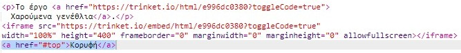

## Επιστροφή στην κορυφή

+ Είναι επίσης χρήσιμο να μπορείς να επιστρέψεις στην κορυφή της ιστοσελίδας. Η HTML έχει το `#top` για αυτό το σκοπό.

+ Πρόσθεσε ένα σύνδεσμο προς το `#top` μετά από κάθε ενσωματωμένο έργο στην ιστοσελίδα σου:

+ Δοκίμασε τους συνδέσμους σου για να ελέγξεις ότι μπορείς να επιστρέφεις στην κορυφή της ιστοσελίδας.