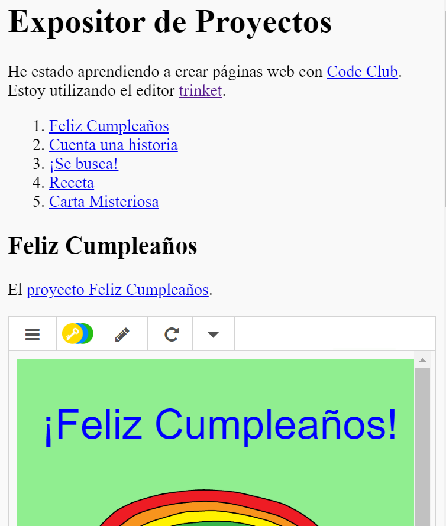

## Introducción

En este proyecto vas a crear un expositor para tus proyectos HTML y vas a aprender acerca de enlaces e incrustración de recursos.

### Información adicional para líderes de club

Si necesitas imprimir este proyecto, usa la [Versión para imprimir](https://projects.raspberrypi.org/en/projects/project-showcase/print).

## \--- collapse \---

## title: Notas para el líder del club

## Introducción:

En este proyecto se va a explicar a los niños los hiperenlaces y la incrustración de trinkets y projectos de Scratch dentro de una página web.

## Recursos en línea

Se recomienda usar [trinket](https://trinket.io/) para programar en HTML y CSS en línea. Este proyecto contiene el siguiente trinket:

* [Punto de partida 'Expositor de Proyectos' - jumpto.cc/web-showcase](http://jumpto.cc/web-showcase)

Los niños también pueden usar este trinket en blanco [(jumpto.cc/html-blank)](http://jumpto.cc/html-blank) para escribir su propio HTML y CSS, o bien esta plantilla de trinket [ (jumpto.cc/html-template) ](http://jumpto.cc/html-template).

También existe un trinket que contiene una solución de ejemplo de los desafíos:

* ['Expositor de Proyectos Completado' -- trinket.io/html/5b815ab120](https://trinket.io/html/5b815ab120)

## Recursos sin conexión

Este proyecto se puede [completar sin conexión](https://www.codeclubprojects.org/en-GB/resources/webdev-working-offline/) si se prefiere. Se puede acceder a los recursos del proyecto haciendo clic en el enlace 'Materiales del proyecto'. Este enlace contiene una sección denominada 'Recursos del Proyecto', que incluye aquellos recursos que los niños necesitarán para poder completar el proyecto sin conexión. Debes asegurarte de que cada niño tenga acceso a una copia de estos recursos. Esta sección incluye los siguientes archivos:

* project-showcase/index.html
* project-showcase/style.css
* template/template.html
* template/style.css

También puedes encontrar una versión completa de los desafíos de este proyecto en la sección 'Recursos para voluntarios', que contiene:

* project-showcse-finished/index.html
* project-showcse-finished/style.css

(Todos los recursos anteriores también se pueden descargar como archivos `.zip` de proyectos y voluntarios.)

Hay que tener en cuenta que si los niños completan sus otros proyectos sin conexión, entonces no los podrán incrustrar, aunque sí los podrán enlazar.

## Objetivos de Aprendizaje

* Este proyecto presenta los enlaces de texto a otras páginas web y a ids con nombre dentro de una página. También muestra cómo incrustar trinkets y proyectos de Scratch en una página web. 

Este proyecto trata elementos de los siguientes aspectos del [Currículo de creación digital de Raspberry Pi](http://rpf.io/curriculum):

* [Diseño de elementos básicos en 2D y 3D](https://www.raspberrypi.org/curriculum/design/creator).

## Desafíos

* “Añade otro enlace” - Añadir enlaces a más páginas web;
* “Crea una lista de tus proyectos” - Crea enlaces a proyectos web anteriores;
* “Incrusta más proyectos” - Utiliza CSS para crear nuevos estilos.

\--- /collapse \---

## \--- collapse \---

## title: Materiales del proyecto

## Recursos del proyecto

* [Archivo .zip que contiene todos los recursos del proyecto](resources/showcase-project-resources.zip)
* [Trinket en línea que contiene todos los recursos del proyecto 'Expositor de Proyectos'](http://jumpto.cc/web-showcase)
* [Plantilla de Trinket en línea](http://jumpto.cc/trinket-template)
* [Trinket en blanco en línea](http://jumpto.cc/trinket-blank)
* [template/index.html](resources/template-index.html)
* [template/style.css](resources/template-style.css)
* [project-showcase/index.html](resources/project-showcase-index.html)
* [project-showcase/style.css](resources/project-showcase-style.css)

## Recursos para el líder del club

* [Archivo.zip que contiene todos los recursos de proyecto completado](resources/showcase-volunteer-resources.zip)
* [Proyecto Trinket completado en línea](https://trinket.io/html/1d4d4c5ce1)
* [project-showcase-finished/index.html](resources/project-showcase-finished-index.html)
* [project-showcase-finished/style.css](resources/project-showcase-finished-style.css)

\--- /collapse \---