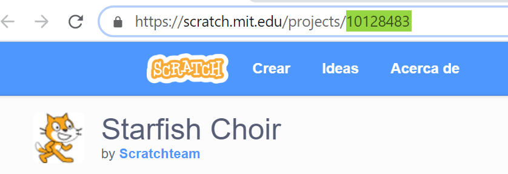

--- challenge ---

## Desafío: Crea un nuevo expositor

Trinkets no es lo único que se puede incrustar en una página web. También puedes incrustar vídeos, widgets (por ejemplo un widget del tiempo) o proyectos de Scratch.

Abre este trinket incrustado de Scratch de ejemplo y ejecútalo: <https://trinket.io/html/9f7212b8fe>

Ve a la página web de Scratch y busca un proyecto que te guste. Puede ser un proyecto tuyo u otro que hayas encontrado.

Si has iniciado sesión, puedes hacer clic en el botón ‘Embebido’ que está debajo del proyecto para obtener el código HTML de incrustación.

Si no has iniciado sesión, entonces busca el número de proyecto de Scratch en su dirección web.

Haz una copia del código `<iframe>` en el trinket del ejemplo de incrustración de Scratch y cambia el número del proyecto por el del proyecto que quieres incrustar:

--- /challenge ---

***
Traducción aportada por la comunidad

Este proyecto fue traducido por Lourdes Paniagua Merchán y revisado por José María Honrado.

Nuestros increíbles voluntarios de traducción nos ayudan a dar a los niños de todo el mundo la oportunidad de aprender a programar. Puedes ayudarnos a llegar a más niños traduciendo nuestros proyectos. Consigue más información en [rpf.io/translate](https://rpf.io/translate).