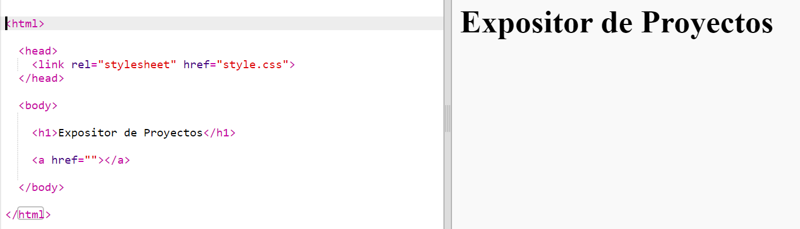

## Añadir enlaces a páginas web

Text links allow you to click on words to go to another web page; they are usually underlined.

+ Abre este Trinket: [jumpto.cc/web-showcase](http://jumpto.cc/web-showcase).
    
    El proyecto debería tener este aspecto:
    
    

+ En HTML se utiliza la etiqueta `<a>` para los enlaces.

+ Encuentra la etiqueta `<a>` en tu proyecto. 

+ Add the Code Club website address [`https://www.codeclub.org.uk`](https://www.codeclub.org.uk) and link text:

+ Haz clic en “Run” (ejecutar) para probar tu trinket.

+ Haz clic en el enlace de Code Club para probar tu página web. Tu trinket mostrará la página de Code Club: 

+ Para volver a tu página web puedes:
    
    + Run (ejecutar) tu trinket de nuevo,
    
    + Pulsar la tecla de Retroceso (Backspace) en el teclado, o
    
    + Hacer clic en el botón derecho del ratón y seleccionar Atrás.

+ Ahora incluye el enlace en una frase dentro de un párrafo:

Test your webpage.