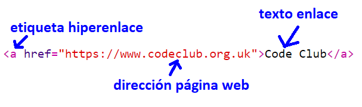
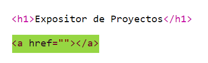
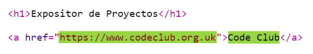
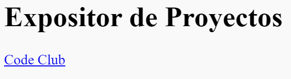
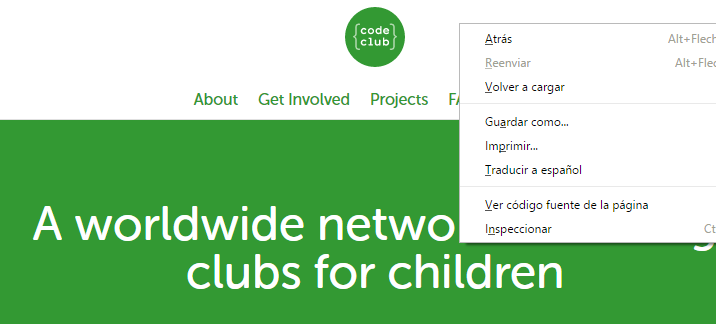
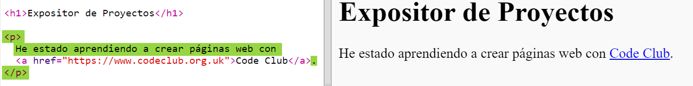

## Añadir enlaces a páginas web

Los enlaces de texto te permiten hacer clic en palabras que te llevan a otras páginas web. Normalmente están subrayados.

+ Abre este trinket: <a href="https://trinket.io/html/9ad31460f0">https://trinket.io/html/9ad31460f0</a>. Si estás leyendo este proyecto en línea, eso es un enlace. También puedes usar el trinket incrustado que verás a continuación. 

  <iframe src="https://trinket.io/embed/html/9ad31460f0" width="100%" height="400" frameborder="0" marginwidth="0" marginheight="0" allowfullscreen>
  </iframe>

+ HTML utiliza la etiqueta `<a>` para los enlaces. 

+ Encuentra la etiqueta `<a>` en tu proyecto. 

+ Añade la dirección de la página web de Code Club <a href="https://www.codeclubworld.org">`https://www.codeclubworld.org`</a> y el texto del enlace:

+ Haz clic en "Run" (ejecutar) para probar tu trinket.

+ Haz clic en el enlace de Code Club para probar la página web. Tu trinket mostrará la página de Code Club: 	

+ Para volver a tu página web tienes varias opciones: 

	+ Ejecuta tu trinket otra vez,

	+ Pulsa la tecla de Retroceso (Backspace) en el teclado, o

	+ Haz clic en el botón derecho del ratón y selecciona Atrás. 

## Lista de tareas de la actividad { .check}

+ Ahora incluye el enlace en una frase dentro de un párrafo:

Prueba tu página web. 
