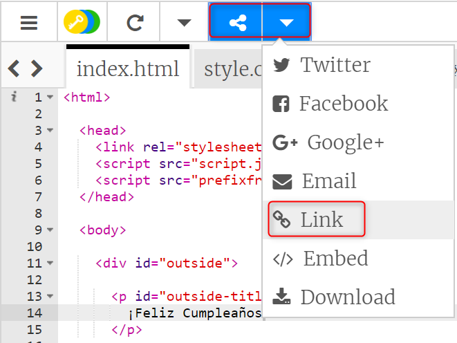
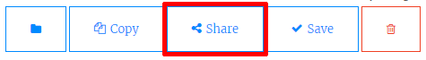
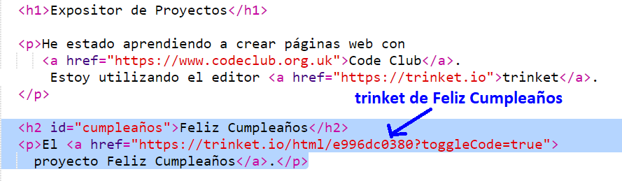
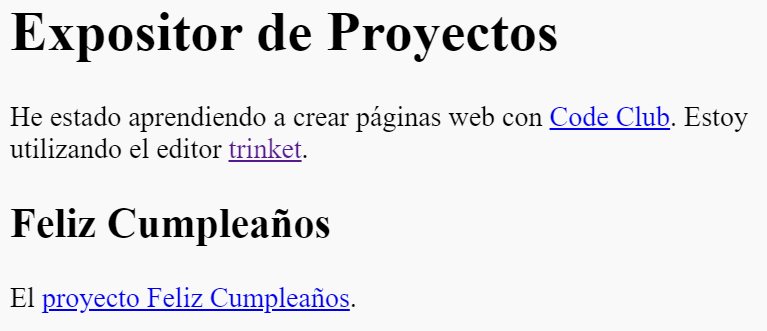

## Enlace a un trinket

Puedes enlazar la página web con un trinket. 

+ ¿Has guardado el enlace de tu trinket Feliz cumpleaños? Si lo tienes, abre ese trinket en otra pestaña o ventana del navegador. Si no lo tienes, usa de ejemplo este trinket que ya está acabado: <a href="https://trinket.io/html/e996dc0380">https://trinket.io/html/e996dc0380</a>

+ Haz clic en el menú Share (compartir) que hay en la parte superior de la pantalla, y selecciona Link (enlace):

Si has abierto el trinket desde tu cuenta, entonces busca la opción Share que se encuentra debajo de tu trinket:

+ Selecciona la opción 'Only show code or result (let users toggle between them)', que significa: "Sólo muestra código o resultado (permitir que los usuarios alternen entre los dos), y copia el enlace del trinket. 

+ Vuelve al trinket Presentación de proyectos y añade un encabezado `<h2>` y un enlace a tu proyecto Feliz cumpleaños.

Prueba tu página web. Debería de parecerse a esta:

Haz clic en el enlace de Feliz cumpleaños para comprobar que te lleve al trinket.
