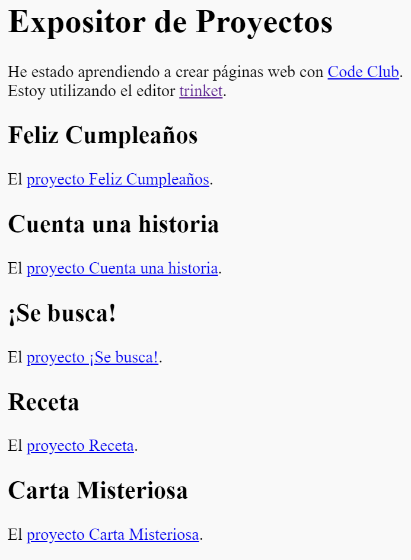

\--- desafío \---

## Desafío: Crea una lista de tus proyectos

Añade alguno de los otros proyectos HTML y CSS que has creado en el Code Club. Utiliza etiquetas de cabecera `<h2>` para organizar tu página web.

Si no tienes los enlaces a los proyectos que has creado, entonces puedes utilizar los ejemplos de Code Club:

+ Feliz Cumpleaños: <https://trinket.io/html/e996dc0380>

+ Cuenta un Cuento: <https://trinket.io/html/c8afdef912>

+ Se Busca: <https://trinket.io/html/ebeb56398a>

+ Receta: <https://trinket.io/html/c0fd9b40cd>

+ Carta Misteriosa: <https://trinket.io/html/1d4d4c5ce1>

Tu página web debería tener un aspecto como éste:

\--- /challenge \---