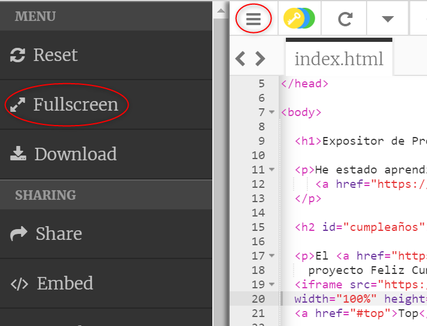
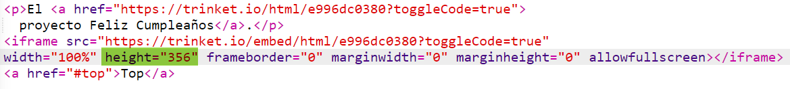

## Incrustar proyectos

Además de crear enlaces a trinkets como páginas web, también se pueden incrustrar dentro deuna página web.

+ Es posible que prefieras trabajar en modo pantalla completa para tener más espacio:

Presiona la tecla Esc para salir del modo de pantalla completa.

+ Run (ejecuta) tu trinket y haz clic en el enlace de Cumpleaños Feliz.

+ Haz clic en el menú de trinket y selecciona **embed**. Es posible que tengas que desplazarte hacia abajo si no estás en modo de pantalla completa. Utiliza la barra de desplazamiento de la derecha o la flecha hacia abajo del teclado.

+ Choose 'Only show code or result (let users toggle between them)' and **copy** the embed code for the trinket. 

+ Trinket has created some HTML for you to include in your webpage. It uses an `<iframe>` tag which allows content to be embedded within a page.

+ Now paste that code under the link to the Happy Birthday trinket:

+ Run your trinket to test it and you should see your Happy Birthday project embedded in the webpage. 

+ You may find that the bottom of your trinket isn't displayed. You can fix that by changing the height value on the `<iframe>`. 

Set the height to **400**. If you made changes to the Happy Birthday project you might need to choose a different value.

