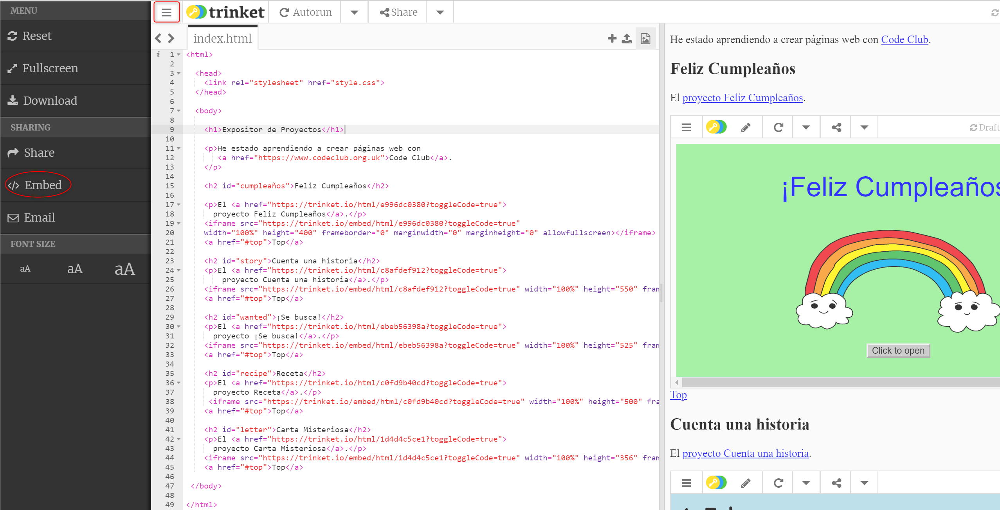
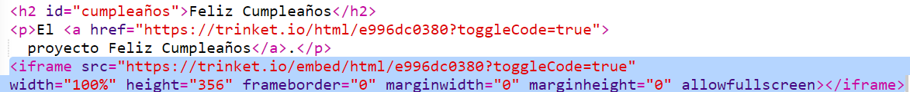
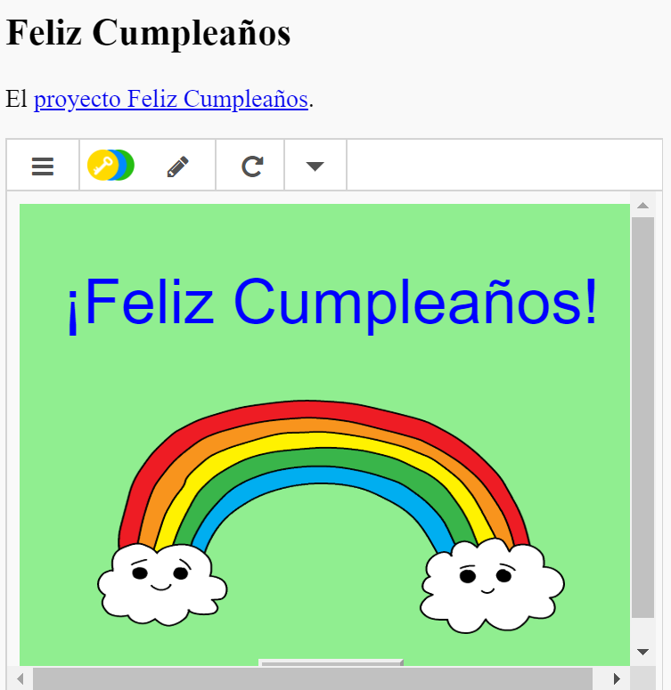
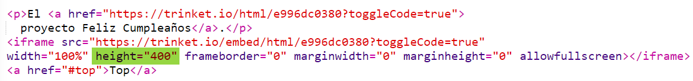

## Incrustar proyectos

Además de enlazar los trinkets como páginas web, también podemos incrustarlos dentro de una página web.

+ Es posible que prefieras trabajar en modo de pantalla completa para tener más espacio:

Presiona la tecla Esc (Escape) para salir del modo de pantalla completa.

+ Ejecuta tu trinket y haz clic en el enlace de Feliz cumpleaños. 

+ Haz clic en el menú de trinket y selecciona __Embed__ (incrustar). Si no estás en modo de pantalla completa, es posible que tengas que desplazarte hacia abajo. Usa la barra de desplazamiento de la derecha o la flecha hacia abajo del teclado.

## Lista de tareas de la actividad { .check}

+ Selecciona 'Only show code or result (let users toggle between them)', que significa "Sólo muestra código o resultado (permitir que los usuarios alternen entre los dos) y __copia__ el código incrustado para el trinket. 

+ Trinket ha creado un HTML para que lo incluyas en tu página web. Este usa una etiqueta `<iframe>` que permite incrustar contenido dentro de una página. 

+ A continuación pega el código debajo del enlace que lleva al trinket de Feliz cumpleaños:

+ Ejecuta tu trinket para probarlo. Deberías ver tu proyecto Feliz cumpleaños incrustado en la página web. 

+ Es posible que la parte inferior de tu trinket no se vea. Puedes arreglarlo cambiando el valor de la altura (height) en la etiqueta `<iframe>`. 

Fija la altura a __400__. Si hiciste cambios en el proyecto Feliz cumpleaños, es posible que tengas que escoger un valor diferente. 

