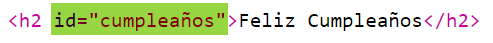
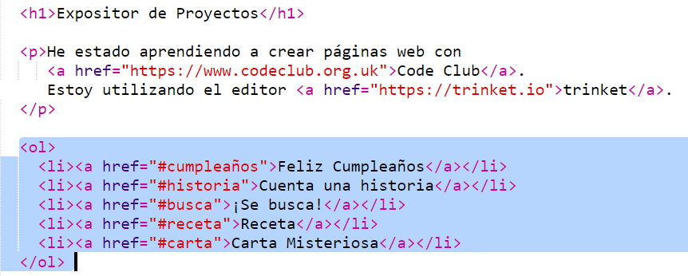
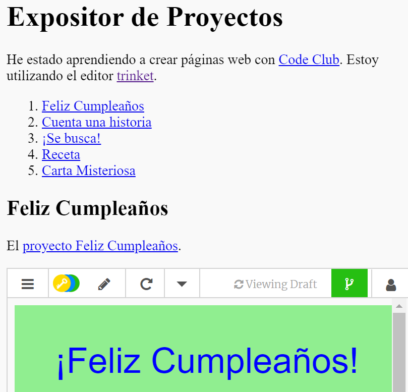

## Crea un índice de contenidos

Vamos a crear un índice de contenidos para poder acceder fácilmente a cada uno de los proyectos.

+ Además de crear enlaces a otras páginas web, también podemos crear enlaces a partes de una página web si les damos un id (identificador). 

Añade un id a la cabecera `<h2>` del proyecto Feliz Cumpleaños:

+ Añade ids a cada uno de tus proyectos y asígnales nombres cortos: cuento, se busca, receta y carta.

+ Puedes crear un enlace a un elemento con un id insertando el símbolo de la almohadilla ‘#’ delante de su nombre. Por ejemplo, `#cumpleaños`.

Crea una lista ordenada de los enlaces a tus proyectos. (Las listas ordenadas se explican en el proyecto Receta.)

+ Ejecuta (Run) tu proyecto y pruébalo haciendo clic en los enlaces para moverte por tus proyectos. 

