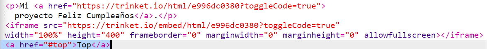
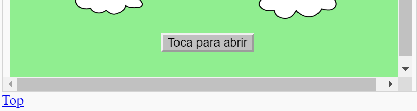

## Volver al principio

+ También es práctico poder volver al principio de la página. HTML tiene `#top` (Arriba) para poder hacerlo. 

+ Añade un enlace a `#top` después de cada proyecto incrustado en tu página web:

+ Prueba tus enlaces haciendo clic en Arriba para volver al principio de la página. 

