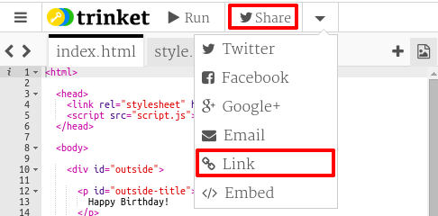

## Enlace a Un Trinket

Puedes enlazar a la página web para un trinket.

+ ¿Guardaste un enlace a tu trinket de Feliz Cumpleaños? Si lo hiciste, entonces abre ese trinket en otra pestaña o ventana del navegador. De lo contrario, abre el trinket del ejemplo terminado: <https://trinket.io/html/e996dc0380>

+ Haz clic en el menú Compartir que se encuentra en la parte de arriba de su trinket, y selecciona Enlace:

Si has abierto el trinket desde tu cuenta, entonces la opción Compartir se encontrará arriba de tu trinket:

+ Elija 'Mostrar solo código o resultado (permita a los usuarios alternar entre ellos)' y copie el enlace al trinket 

+ Regrese a su trinket Proyecto Showcase, agregue un título `<h2>` y un enlace a su Proyecto Feliz Cumpleaños

Prueba tu página web; debería verse así:

Haz clic en el enlace Feliz Cumpleaños para comprobar que lo lleva al trinket.