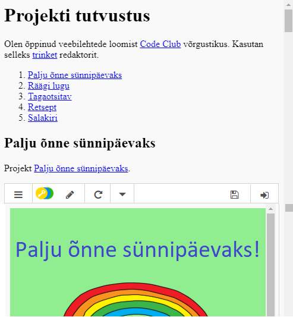

## Sissejuhatus

Selles projektis lood oma HTML-projektide tutvustuse, saad teada linkide kohta ning õpid, kuidas manustada ressursse.

### Lisainfo ringijuhendajatele

Kui sul on vaja see projekt välja printida, siis kasuta [printerisõbralikku versiooni](https://projects.raspberrypi.org/en/projects/project-showcase/print).

## \--- collapse \---

## title: Ringijuhendaja märkmed

## Sissejuhatus:

Selles projektis tutvustatakse lastele hüperlinke ja veebilehel asuvate trinketite ning Scratchi projektide manustamist.

## Internetiressursid

HTML-i & CSS-i kirjutamiseks võrgus soovitame kasutada [trinketit](https://trinket.io/). See projekt sisaldab järgmist trinketit:

* ["Projekti tutvustuse" lähtepunkt -- jumpto.cc/web-showcase](http://jumpto.cc/web-showcase)

Lapsed võivad kasutada ka seda tühja trinketit [(jumpto.cc/html- blank)](http://jumpto.cc/html-blank) oma HTML-i & CSS-i kirjutamiseks või alternatiivina saavad nad kasutada seda näidistrinketit [(jumpto.cc/html-memplate)](http://jumpto.cc/html-template).

Leidub ka trinket, mis sisaldab näidislahendust väljakutsetele:

* ["Projekti tutvustus lõpetatud" -- trinket.io/html/5b815ab120](https://trinket.io/html/5b815ab120)

## Võrguvälised ressursid

Selle projekti saab soovi korral [lõpetada võrguühenduseta](https://www.codeclubprojects.org/en-GB/resources/webdev-working-offline/). Saad ligipääsu projekti ressurssidele, klõpsates selle projekti "Projekti materjalide" lingil. See link sisaldab jaotist "Projekti ressursid", mis sisaldab ressursse, mida lapsed selle projekti võrguühenduseta lõpetamiseks vajavad. Veenduge, et igal lapsel on juurdepääs nende ressursside koopiale. See jaotis sisaldab järgmisi faile:

* project-showcase/index.html
* project-showcase/style.css
* template/template.html
* template/style.css

Selle projekti väljakutsete lõpetatud versiooni leiate ka jaotisest "Vabatahtlikud ressursid", mis sisaldab järgmist:

* project-showcase-finished/index.html
* project-showcase-finished/style.css

(Kõik ülaltoodud ressursid on samuti alla laaditavad projekti ja vabatahtliku `.zip` failina.)

Pidage meeles, et kui lapsed on oma muud projektid võrguühenduseta lõpetanud, ei saa nad neid manustada, kuid nad saavad need ikkagi linkida.

## Õpieesmärgid

* See projekt tutvustab tekstilinke teistele veebilehtedele ja lehel asuvatele nimega Id-idele. Samuti tutvustab see veebisaidile trinketite ja Scratchi projektide manustamist. 

See projekt hõlmab elemente, mis on välja toodud järgmiselt: [raspberry pi digitaalse loomise õppekava](http://rpf.io/curriculum):

* [Disaini põhilised 2D ja 3D varad](https://www.raspberrypi.org/curriculum/design/creator).

## Väljakutsed

* "Lisage teine ​​link" - lisage linke rohkematele veebilehtedele;
* "Loo oma projektide loend" - loo lingid eelmistele veebiprojektidele;
* "Embed rohkem projekte" - kasutage CSS-i uute stiilide loomiseks.

\--- / kollaps \---

## \--- kokkuvarisemine \---

## pealkiri: projekti materjalid

## Projekti ressursid

* [.zip-fail, mis sisaldab kõiki projekti ressursse](resources/showcase-project-resources.zip)
* [Online kinkekomplekt, mis sisaldab kõiki projektiekriessursse](http://jumpto.cc/web-showcase)
* [Online trikke mall](http://jumpto.cc/trinket-template)
* [Hetkel tühi trikk](http://jumpto.cc/trinket-blank)
* [mall / indeks.html](resources/template-index.html)
* [mall / style.css](resources/template-style.css)
* [projekti-showcase / index.html](resources/project-showcase-index.html)
* [projekti-showcase / style.css](resources/project-showcase-style.css)

## Klubi liidri ressursid

* [.zip-fail, mis sisaldab kõiki lõpetatud projekti ressursse](resources/showcase-volunteer-resources.zip)
* [Online lõpetas kalliskivi projekti](https://trinket.io/html/1d4d4c5ce1)
* [projekt-showcase-finished / index.html](resources/project-showcase-finished-index.html)
* [projekt-showcase-finished / style.css](resources/project-showcase-finished-style.css)

\--- / kollaps \---