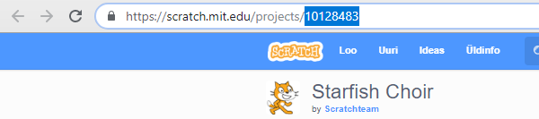

\--- challenge \---

## Väljakutse: loo uus tutvustus

Trinketid pole ainus asi, mida saad veebilehele manustada. Saad lisada videoid, vidinaid (nt ilmastiku vidina) või Scratchi projekte.

Ava Manusta Scratchi näidistrinket ja Käivita see: <https://trinket.io/html/9f7212b8fe>

Mine Scratchi veebisaidile ja leia projekt, mis sulle meeldib. See võib olla üks sinu omadest või üks, mille oled leidnud.

Kui oled sisse loginud, võid HTML-i manustamise koodi saamiseks klõpsata projekti allosas oleval nupul "Manusta".

Kui sa pole sisse loginud, siis otsi Scratchi projekti numbrit selle veebiaadressis.

Tee koodi `<iframe>` koopia Scratchi Manustamise näites ja muuda projekti number selle projekti numbriks, mida soovid lisada:

\--- /challenge \---