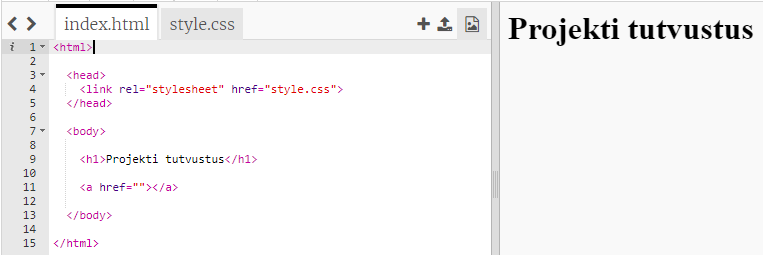
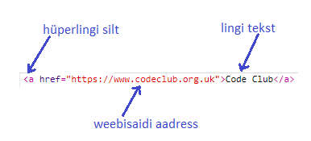
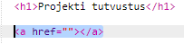
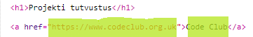
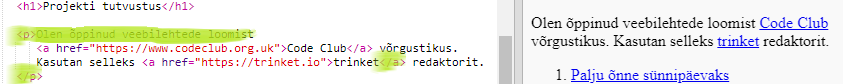

## Veebilehtede linkide lisamine

Tekstlingid võimaldavad teil klõpsata sõnadel, et minna teisele veebilehele; need on tavaliselt allajoonitud.

+ Avage see nipsus: [jumpto.cc/web-showcase](http://jumpto.cc/web-showcase).
    
    Projekt peaks olema selline:
    
    

+ HTML kasutab linkide jaoks `<a>` märgistust.

+ Leidke projektis `<a>` silt. 

+ Lisage koodiklubi veebisaidi aadress [`https://www.codeclub.org.uk`](https://www.codeclub.org.uk) ja link tekst:

+ Klõpsake käsku Käivita, et proovida oma nipsutit

+ Veebilehe testimiseks klikkige lingil Code Club. Teie nurk näitab nüüd Code Clubi veebilehte: 

+ Teie lehele naasmiseks võite kas:
    
    + Käivitage oma nipsu uuesti
    
    + Puuduta klaviatuuri Backspace klahvi või
    
    + Paremklõpsake ja valige Tagasi.

+ Nüüd panna oma link lõike sisusse:

Proovige oma veebilehte.