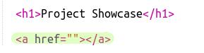

## Linkide lisamine veebilehtedele

Tekstlingid võimaldavad sul klõpsata sõnadel, et minna teisele veebilehele; need on tavaliselt allajoonitud.

+ Ava see trinket: [jumpto.cc/web-showcase](http://jumpto.cc/web-showcase).
    
    Projekt peaks välja nägema selline:
    
    

+ HTML kasutab linkide jaoks `<a>` silti.

+ Leia oma projektis `<a>` silt. 

+ Lisa Code Clubi veebisaidi aadress [`https://www.codeclub.org.uk`](https://www.codeclub.org.uk) ja lingi tekst:

+ Klõpsa nupul Käivita, et oma trinketit testida.

+ Veebilehe testimiseks klõpsa Code Clubi lingil. Sinu trinket näitab nüüd Code Clubi veebilehte: 

+ Oma lehele naasmiseks võid:
    
    + Oma trinketi uuesti käivitada,
    
    + Vajutada klaviatuuril Backspace klahvi või
    
    + Paremklõpsata ja valida Tagasi.

+ Nüüd pane oma link lõigu lausesse:

Testi oma veebilehte.