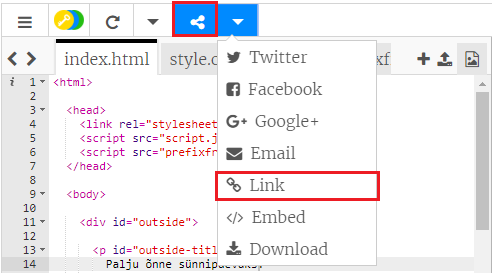
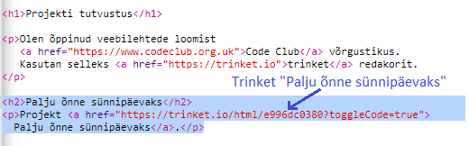
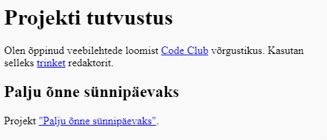

## Link to Trinket

Võite linkida veebilehitseja nippi.

+ Kas hoidsite linki oma õnnelik sünnipäeva pruutmisega? Kui te siis avasite selle nipsu mõnes teises brauseri sakkis või aknas. Vastasel juhul avage valmis näpistüüp: <https://trinket.io/html/e996dc0380>

+ Klõpsake oma privaatsuses oleval jagamise menüül ja valige link:

If you opened the trinket from your account then look for the Share option above your trinket instead:

+ Valige "Näita ainult koodi või tulemust (lubage kasutajatel nende vahel vahetada)" ja kopeeri link trikkina. 

+ Minge tagasi oma Project Showcase nipsusse ja lisage pealkiri `<h2>` ja link oma õnne sünnipäeva projektile.

Testige oma veebilehte; see peaks välja nägema umbes selline:

Klõpsake õnne sünnipäeva linki, et kontrollida, kas see viib teid kinkimiseks.