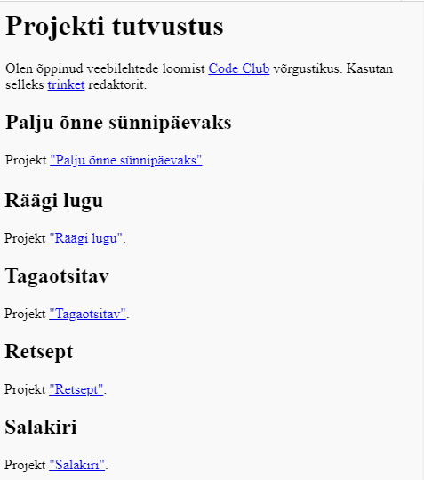

\--- väljakutse \---

## Väljakutse: loo oma projektide nimekiri

Lisage mõned teised HTML & CSS-i projektid, mille olete loonud Code Club'is. Kasutage oma veebilehe korraldamiseks `<h2>` rubriiki.

Kui teil pole lingid loodud projektidele, võite kasutada Code Club'i näiteid:

+ Palju õnne sünnipäeval: <https://trinket.io/html/e996dc0380>

+ Räägi lugu: <https://trinket.io/html/c8afdef912>

+ Soovitud: <https://trinket.io/html/ebeb56398a>

+ Retsept: <https://trinket.io/html/c0fd9b40cd>

+ Mystery Letter: <https://trinket.io/html/1d4d4c5ce1>

Teie valmis leht peaks nägema midagi sellist:

\--- / väljakutse \---