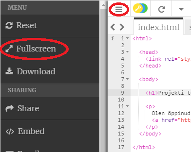
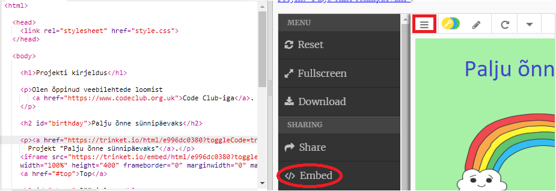
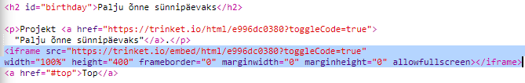
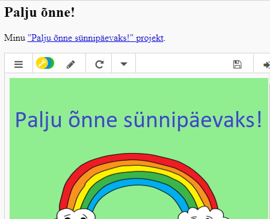
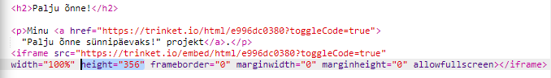
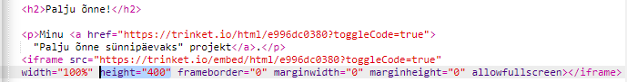

## Projektide kaasamine

Samuti võite veebilehtede nööbritega linkimisega lisada need ka veebilehele.

+ Võite proovida töötada täisekraanirežiimis, nii et teil on rohkem ruumi:

Täisekraani režiimi väljumiseks vajutage Esc.

+ Käivitage oma nips ja klõpsake linki Happy Birthday.

+ Klõpsake hiireklõpsu menüül ja valige **embed**. Kui te pole täisekraanirežiimis, võib teil olla vaja kerida. Klõpsake klaviatuuri paremal või alla all oleval noolel olevat kerimisriba.

+ Vali "Näita ainult koodi või tulemust (lubage kasutajatel nende vahel vahetada)" ja **kopeeri** prindikasse sisestatud koodi. 

+ Trinket on loonud mõne HTML-i, mida saaksite oma veebilehel lisada. Selles kasutatakse märgistust `<iframe>` mis lubab sisu sisestada lehele.

+ Nüüd kleepige see kood Happy Birthday kleebise lingile all:

+ Proovige oma nippe katsetamiseks ja näed oma veebilehel põgusat õnne sünnipäeva projekti. 

+ Võite avastada, et teie nipsümboli põhja ei kuvata. Seda saab parandada `<iframe>`kõrguse väärtuse muutmisega. 

Määrake kõrgus **400**. Kui te tegite muudatusi õnnelik sünnipäeva projektis, peate võib-olla valima teise väärtuse.

