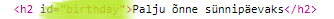
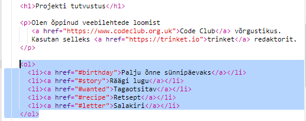
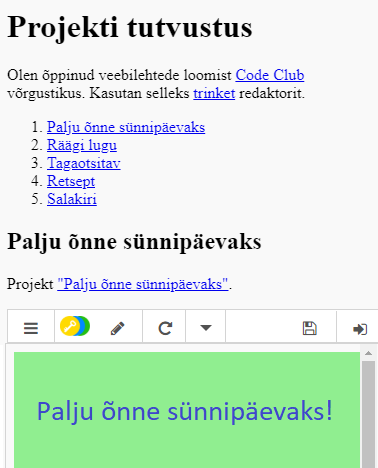

## Loo sisukord

Lisame sisukorra, et saaksime igale projektile kergesti juurde pääseda.

+ Lisaks sellele, et meil on võimalik linkida ka teisi veebilehti, võime linkida veebilehe osi, kui anname neile ID. 

Palju õnne sünnipäeva projekti jaoks lisage ID-i rubriiki `<h2>`:

+ Lisage igale oma projektile idsid ja anna neile lühikesi nimesid: lugu, tahtmist, retsepti ja kirja.

+ Saate linkida idiga elemendiga, asetades oma nime ees räsi "#". Näiteks `# sünnipäev`.

Looge oma projektide linkide järjekordne loend. (Tellitud nimekirjad lisatakse retseptprojekti.)

+ Käitage oma projekti ja katsetage seda, klõpsates lingil, et oma projektidesse minna. 

