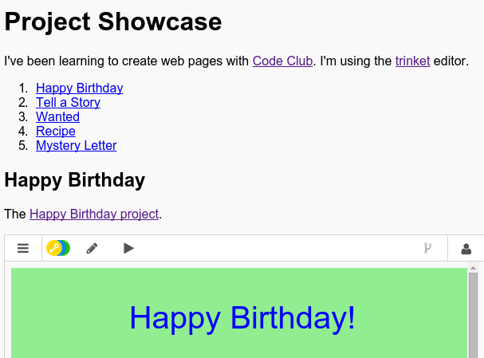

## Loo sisukord

Lisame sisukorra, et saaksime igale projektile kergesti ligi pääseda.

+ Lisaks sellele, et meil on võimalik linkida ka teisi veebilehti, võime linkida veebilehe osi, kui anname neile ID. 

Palju õnne sünnipäevaks projekti jaoks lisa ID rubriiki `<h2>`:

+ Lisa igale oma projektile ID-d ja anna neile lühikesed nimed: lugu, tagaotsitav, retsept ja kiri.

+ Saate linkida idiga elemendiga, asetades oma nime ees räsi "#". Näiteks `# sünnipäev`.

Looge oma projektide linkide järjekordne loend. (Tellitud nimekirjad lisatakse retseptprojekti.)

+ Käitage oma projekti ja katsetage seda, klõpsates lingil, et oma projektidesse minna. 

