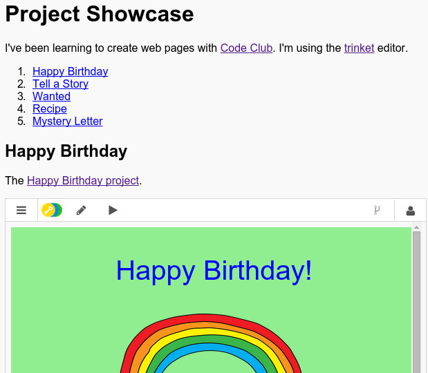

## معرفی

در این پروژه شما یک نمایشگاه پروژه های HTML خود را ایجاد خواهید کرد و در مورد پیوندها و تعبیه منابع یاد خواهید گرفت.

### اطلاعات اضافی برای رهبران باشگاه

اگر شما نیاز به چاپ این پروژه، لطفا با استفاده از [پرینتر نسخه دوستانه](https://projects.raspberrypi.org/en/projects/project-showcase/print).

## \--- سقوط - فروپاشی \---

## عنوان: رهبر باشگاه یادداشت می کند

## معرفی:

در این پروژه، بچه ها به لینک ها و جاسازی ناقص و طرح های خراش در یک صفحه وب معرفی شده است.

## منابع آنلاین

توصیه می کنیم با استفاده از [trinket](https://trinket.io/) برای نوشتن HTML & CSS آنلاین. این پروژه شامل موارد زیر است:

* [نقطه شروع پروژه - jumpto.cc/web-showcase](http://jumpto.cc/web-showcase)

کودکان همچنین می توانند از این پنل خالی [(jumpto.cc/html-blank)](http://jumpto.cc/html-blank) برای نوشتن CSS HTML & خود استفاده کنند یا از این الگو [(jumpto.cc/html-template)](http://jumpto.cc/html-template).

همچنین یک نکته حاوی یک راه حل نمونه برای این چالش ها وجود دارد:

* ['نمایشگاه پروژه نهایی' - trinket.io/html/5b815ab120](https://trinket.io/html/5b815ab120)

## منابع آفلاین

این پروژه می تواند [به پایان نیست](https://www.codeclubprojects.org/en-GB/resources/webdev-working-offline/) اگر ترجیح داده. شما می توانید با کلیک روی لینک «Project Materials» برای این پروژه به منابع پروژه دسترسی پیدا کنید. این لینک حاوی بخش «منابع پروژه» است که شامل منابعی است که کودکان باید این پروژه را بدون نیاز به تکمیل انجام دهند. اطمینان حاصل کنید که هر کودک به یک کپی از این منابع دسترسی داشته باشد. این بخش شامل فایل های زیر است:

* پروژه نمایشگاه / index.html
* پروژه نمایشگاه / style.css
* الگو / template.html
* الگو / style.css

شما همچنین می توانید یک نسخه کامل از چالش های این پروژه را در بخش «منابع داوطلبانه» پیدا کنید که شامل موارد زیر است:

* پروژه showcse-finished / index.html
* پروژه showcase / finish.css

(تمام منابع موجود در بالا نیز به عنوان پروژه و داوطلب `.zip` فایل قابل دانلود هستند.)

توجه داشته باشید که اگر بچه ها پروژه های دیگر خود را به اتمام رسانده اند، آنها قادر به بستن آنها نخواهند بود، اما هنوز قادر به پیوند به آنها نیستند.

## اهداف یادگیری

* این پروژه لینک های متنی را به صفحات دیگر و به نام شناسه ها در یک صفحه معرفی می کند. این همچنین نکته جاسازی و طرح های خراش را به یک صفحه وب معرفی می کند. 

این پروژه عناصر را از رشته های زیر از [Raspberry Pi Digital Making Curriculum](http://rpf.io/curriculum):

* [طراحی پایه های 2D و 3D دارایی](https://www.raspberrypi.org/curriculum/design/creator).

## چالش ها

* "اضافه کردن یک لینک دیگر" - اضافه کردن لینک به وب سایت های بیشتر؛
* "ایجاد یک لیست از پروژه های شما" - ایجاد لینک به پروژه های وب قبلی؛
* "قراردادن پروژه های بیشتر" - استفاده از CSS برای ایجاد سبک های جدید.

\--- /سقوط - فروپاشی \---

## \--- سقوط - فروپاشی \---

## عنوان: مواد پروژه

## منابع پروژه

* [.zip فایل حاوی تمام منابع پروژه](resources/showcase-project-resources.zip)
* [بیلیارد آنلاین حاوی تمام منابع پروژه پروژه "نمایشگاه" است](http://jumpto.cc/web-showcase)
* [قالب بیلیارد آنلاین](http://jumpto.cc/trinket-template)
* [بلوتوث خالی آنلاین](http://jumpto.cc/trinket-blank)
* [template / index.html](resources/template-index.html)
* [الگو / style.css](resources/template-style.css)
* [پروژه نمایشگاه / index.html](resources/project-showcase-index.html)
* [پروژه نمایشگاه / style.css](resources/project-showcase-style.css)

## منابع رهبر باشگاه

* [.zip فایل حاوی تمام منابع پروژه تکمیل شده](resources/showcase-volunteer-resources.zip)
* [آنلاین تکمیل پروژه بلوتوث](https://trinket.io/html/1d4d4c5ce1)
* [پروژه نمایشگاه کامل / index.html](resources/project-showcase-finished-index.html)
* [پروژه تکمیل شده / style.css](resources/project-showcase-finished-style.css)

\--- /سقوط - فروپاشی \---