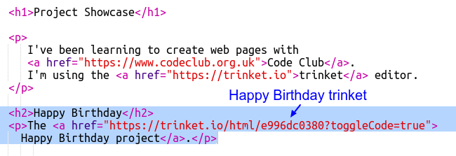

## لینک به یک نینجا

شما می توانید برای یک صفحه وب به صفحه وب لینک کنید.

+ آیا شما پیوندی را با تی شرت تولدت مبارک دارید؟ اگر بعد از آن باز شدید آن را در یک برگه یا پنجره دیگر مرورگر باز کنید. در غیر اینصورت نکته به پایان رسیده را باز کنید: <https://trinket.io/html/e996dc0380>

+ با کلیک بر روی منوی اشتراک گذاری در بالا از شلوار خود را انتخاب کنید و لینک را انتخاب کنید:

اگر نکته را از حساب کاربری خود باز کردید، به جای آن گزینه گزینه Share را در بالای صفحه انتخاب کنید.

+ را انتخاب کنید "فقط کد نمایش یا نتیجه (اجازه دهید کاربران بین آنها را تغییر دهید)" و کپی لینک به نیشکر. 

+ بازگشت به پروژه نامناسب پروژه شما و اضافه کردن یک عنوان `<h2>` و یک پیوند به پروژه تولد تولدت مبارک.

وب سایت خود را آزمایش کنید این باید چیزی شبیه به این باشد:

روی پیوند تولدت مبارک کلیک کنید تا تست کنید که شما را به نینجا می برد