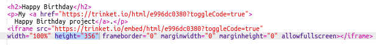

## کدهای پروژه

همچنین با پیوند دادن به دلایلی به عنوان صفحات وب، می توانیم آنها را در یک صفحه وب جاسازی کنیم.

+ شما ممکن است بخواهید سعی کنید در حالت تمام صفحه کار کنید تا فضای بیشتری داشته باشید:

برای خروج از حالت تمام صفحه، Esc را فشار دهید.

+ نازک خود را اجرا کنید و روی لینک تولدت مبارک کلیک کنید.

+ روی منوی نازک کلیک کنید و **جاسازی**انتخاب کنید. اگر شما در حالت Fullscreen نیستید، ممکن است مجبور شوید آن را مرور کنید. از نوار پیمایش در پیکان راست یا پایین در صفحه کلید استفاده کنید.

+ را انتخاب کنید 'فقط کد نمایش یا نتیجه (اجازه دهید کاربران بین آنها را تغییر دهید)' و **کپی** کد جاسازی برای نیشکر. 

+ بلوتوث برخی از HTML ها را برای شما در صفحه وب شما ایجاد کرده است. این تگ یک تگ `<iframe>` که اجازه می دهد محتوا در یک صفحه جاسازی شود.

+ حالا کد زیر را در زیر لینک زیر به نام Blinket Happy Birthday بگذارید:

+ نکته جالب خود را برای آزمایش آن انجام دهید و باید پروژه تولدت مبارک خود را که در صفحه وب جاسازی شده مشاهده کنید. 

+ شما ممکن است متوجه شوید که پایین شلوار شما نمایش داده نمی شود. شما می توانید این را با تغییر مقدار ارتفاع در `<iframe>`تعمیر کنید. 

ارتفاع را به **400**تنظیم کنید. اگر به پروژه تولدت مبارک تغییراتی داده اید ممکن است نیاز به انتخاب یک مقدار متفاوت داشته باشید.

