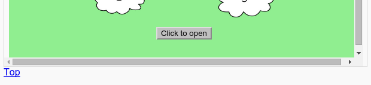

## بازگشت به بالا

+ همچنین مفید است که قادر به حرکت به بالای صفحه باشد. HTML دارای `#top` برای این منظور است.

+ یک پیوند به `#top` بعد از هر پروژه جاسازی شده در صفحه وب خود اضافه کنید:

+ لینک های خود را با کلیک بر روی بالا برای بازگشت به بالای صفحه تست کنید.